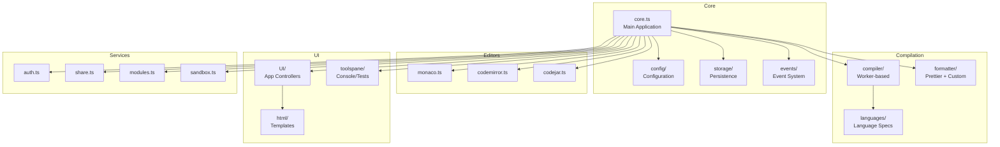

# LiveCodes Contribution Guide

This directory contains comprehensive documentation for contributors working on the LiveCodes codebase. Each document covers a specific system or aspect of the application.

**New to contributing?** Start with the [beginner-friendly introduction](https://github.com/live-codes/livecodes/blob/develop/CONTRIBUTING.md), including setup instructions, pull request guidelines, and code of conduct.

## Quick Start

1. Read the [Architecture Overview](./architecture.mdx) first to understand the high-level design
2. Review the [Build System](./build-system.mdx) to understand how the project is built
3. Check the [Code Style](#code-style) section below for coding conventions

## Documentation Index

### Core Systems

| Document                                     | Description                                                               |
| -------------------------------------------- | ------------------------------------------------------------------------- |
| [architecture.mdx](./architecture.mdx)       | High-level architecture overview with diagrams of all major systems       |
| [compiler-system.mdx](./compiler-system.mdx) | Language compilation pipeline, worker architecture, and import resolution |
| [config-system.mdx](./config-system.mdx)     | Configuration management, validation, and URL parameter handling          |
| [storage-system.mdx](./storage-system.mdx)   | Client-side storage using IndexedDB and localStorage                      |

### Editor & UI

| Document                                             | Description                                                   |
| ---------------------------------------------------- | ------------------------------------------------------------- |
| [editor-system.mdx](./editor-system.mdx)             | Multi-editor support (Monaco, CodeMirror, CodeJar) and themes |
| [ui-design-system.mdx](./ui-design-system.mdx)       | UI components, styling, theming, and responsive design        |
| [tools-pane-system.mdx](./tools-pane-system.mdx)     | Console, compiled code viewer, and test runner                |
| [notifications-system.md](./notifications-system.md) | Toast notification system                                     |

### Language Support

| Document                                                     | Description                                        |
| ------------------------------------------------------------ | -------------------------------------------------- |
| [language-support-system.mdx](./language-support-system.mdx) | Language specifications, processors, and utilities |
| [adding-languages.mdx](./adding-languages.mdx)               | Step-by-step guide to add new language support     |
| [type-loader-system.mdx](./type-loader-system.mdx)           | TypeScript type acquisition for IntelliSense       |

### Features

| Document                                                   | Description                                               |
| ---------------------------------------------------------- | --------------------------------------------------------- |
| [import-system.mdx](./import-system.mdx)                   | Import from GitHub, GitLab, files, URLs, and more         |
| [export-system.mdx](./export-system.mdx)                   | Export to JSON, ZIP, HTML, CodePen, JSFiddle, GitHub Gist |
| [result-page.mdx](./result-page.mdx)                       | Result iframe generation and sandbox creation             |
| [code-formatting-system.mdx](./code-formatting-system.mdx) | Prettier integration and custom formatters                |

### Services & Infrastructure

| Document                                     | Description                                                |
| -------------------------------------------- | ---------------------------------------------------------- |
| [services-system.mdx](./services-system.mdx) | External services: auth, share, CDN resolution, CORS proxy |
| [build-system.mdx](./build-system.mdx)       | Build scripts, outputs, and development workflow           |

### Internationalization

| Document               | Description                                                      |
| ---------------------- | ---------------------------------------------------------------- |
| [i18n.mdx](./i18n.mdx) | Translation workflow, Lokalise integration, and script reference |

### Testing & Development

| Document                         | Description                               |
| -------------------------------- | ----------------------------------------- |
| [storybook.mdx](./storybook.mdx) | Storybook setup for SDK component testing |

### Release

| Document                     | Description                             |
| ---------------------------- | --------------------------------------- |
| [release.mdx](./release.mdx) | Release workflow and version management |

## Code Style

LiveCodes follows specific coding conventions documented in `AGENTS.md` at the repository root. Key points:

### Formatting (Prettier)

- Semicolons: always
- Single quotes
- Trailing commas: all
- Print width: 100

### Imports

Use `import type` for type-only imports:

```typescript
import type { Config, Language } from '../models';
import { someFunction } from '../utils';
```

### Naming Conventions

- **Files/directories:** kebab-case (`build-config.ts`)
- **Functions/variables:** camelCase (`createEventsManager`)
- **Types/interfaces:** PascalCase (`CompileResult`)
- **No enums:** use string union types

### Functions and Exports

- Arrow function constants preferred
- Named exports only (no default exports)
- No classes in application code
- Use factory functions (`createXxx()`)
- One variable per statement

### Testing

Tests are co-located in `__tests__/` directories:

```typescript
import { debounce } from '..';

describe('utils', () => {
  test('debounce', async () => {
    expect(num).toBe(1);
  });
});
```

## Running Tests

```bash
npm run test              # Run all tests (typecheck + lint + unit)
npm run test:unit         # Run Jest unit tests only
npm run test:unit -- --testPathPattern="compiler"  # Run specific tests
npm run e2e               # Run Playwright e2e tests
npm run typecheck:app     # TypeScript type check
npm run lint:eslint       # ESLint check
npm run fix               # Auto-fix all linting issues
```

## Development Workflow

```bash
npm run start             # Dev server with watch (http://127.0.0.1:8080)
npm run build             # Full production build
npm run docs              # Start documentation server (http://localhost:3000/docs)
npm run storybook         # Start storybook (http://localhost:6006)
```

## Architecture Overview



## Key Design Principles

1. **Client-side only** - All compilation happens in the browser
2. **Worker-based compilation** - Heavy work off main thread
3. **Lazy loading** - Compilers and editors loaded on demand
4. **Modular architecture** - Factory functions, no classes
5. **Type safety** - Strict TypeScript with explicit types

## Getting Help

- Open an issue: [GitHub Issues](https://github.com/live-codes/livecodes/issues)
- Discussion: [GitHub Discussions](https://github.com/live-codes/livecodes/discussions)
- Documentation: [livecodes.io/docs](https://livecodes.io/docs)
