# Architecture Overview

This document provides a comprehensive high-level overview of LiveCodes architecture, showing the major systems and how they connect together.

## Table of Contents

- [High-Level Architecture](#high-level-architecture)
- [Core Systems](#core-systems)
- [Data Flow](#data-flow)
- [Key Workflows](#key-workflows)
- [System Interactions](#system-interactions)

---

## High-Level Architecture

LiveCodes is a client-side code playground that runs entirely in the browser. The architecture follows a modular design with clear separation of concerns.

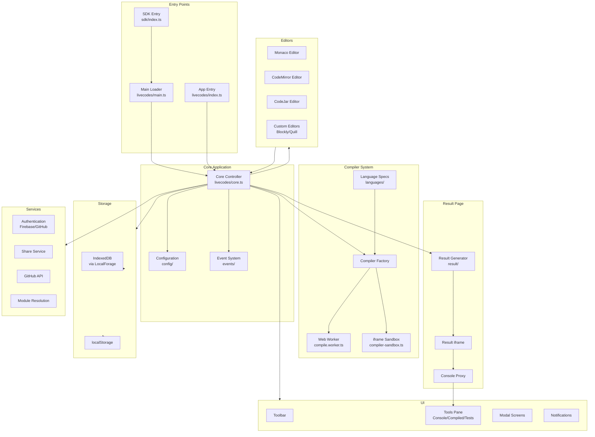

---

## Core Systems

### 1. Entry Points

LiveCodes has multiple entry points depending on the use case:

| Entry Point | File                     | Purpose                                    |
| ----------- | ------------------------ | ------------------------------------------ |
| SDK         | `src/sdk/index.ts`       | JavaScript/TypeScript SDK for embedding    |
| App         | `src/livecodes/index.ts` | Main application entry with loading screen |
| Main        | `src/livecodes/main.ts`  | Orchestrates app loading in iframe         |

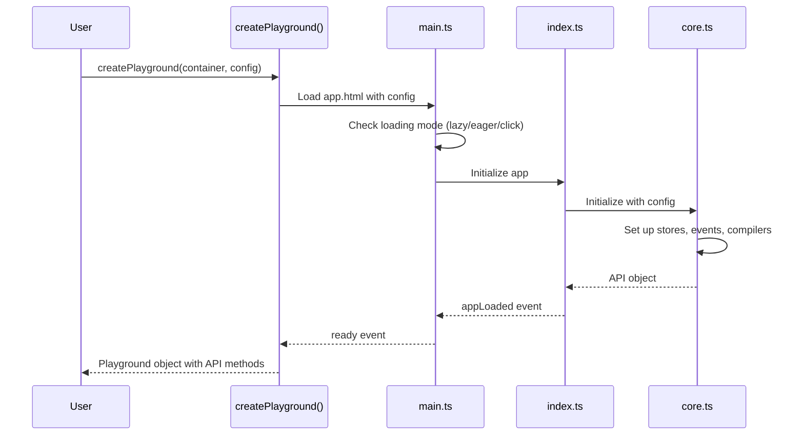

### 2. Core Controller (`core.ts`)

The core controller is the orchestrator of the entire application. It manages:

- **State Management**: Configuration, editors, cache
- **Lifecycle**: Initialization, destruction, event handling
- **Coordination**: Connecting all subsystems

Key responsibilities:

```typescript
// Core state (module-level)
const stores: Stores = createStores();
const eventsManager = createEventsManager();
let editors: Editors;
let compiler: Compiler;
let formatter: Formatter;
let toolsPane: ToolsPane;
```

Core initialization flow:

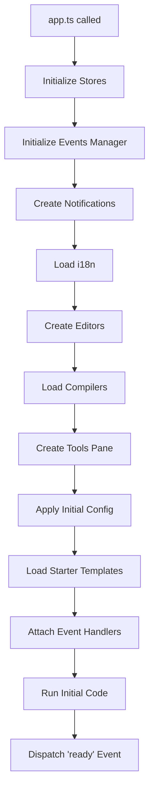

### 3. Configuration System

The configuration system manages all application state:

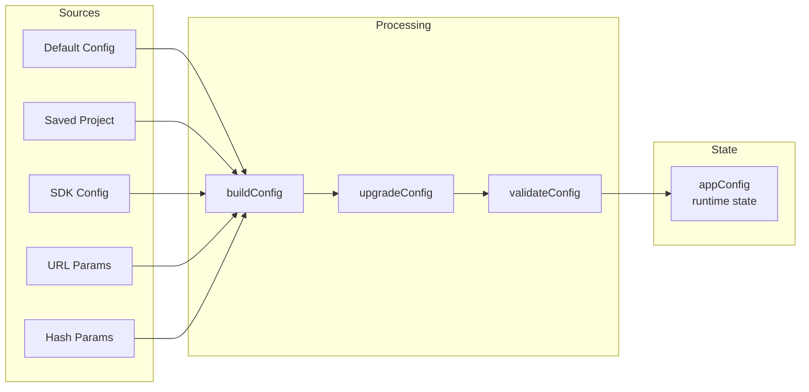

**Configuration Categories**:

| Category        | Description                               | Extractor              |
| --------------- | ----------------------------------------- | ---------------------- |
| ContentConfig   | Project content (markup, style, script)   | `getContentConfig()`   |
| AppConfig       | App behavior (readonly, mode, tools)      | `getAppConfig()`       |
| UserConfig      | User preferences (theme, autoupdate)      | `getUserConfig()`      |
| EditorConfig    | Editor settings (font, line numbers)      | `getEditorConfig()`    |
| FormatterConfig | Formatting settings (tabSize, semicolons) | `getFormatterConfig()` |

### 4.Editor System

The editor system provides a unified interface for multiple code editors:

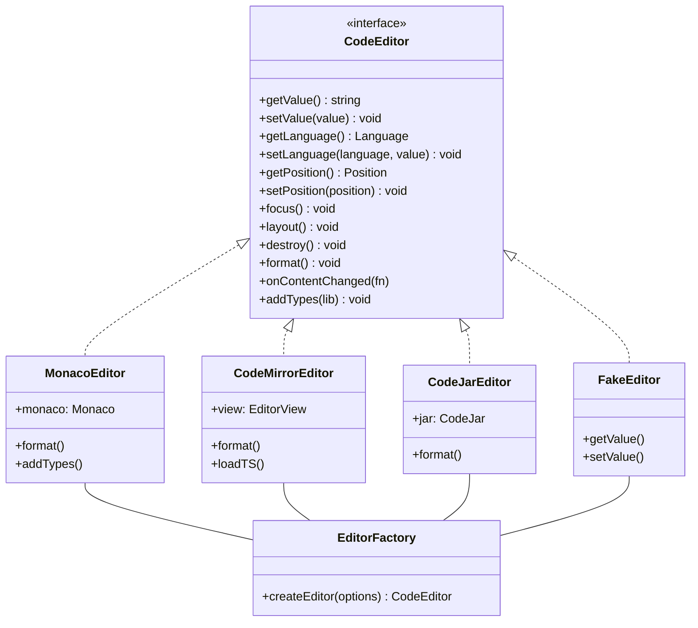

**Editor Selection Logic**:

| Mode                            | Selected Editor |
| ------------------------------- | --------------- |
| Headless                        | Fake            |
| Result                          | Fake            |
| Simple (inactive)               | Fake            |
| Simple (active)                 | CodeMirror      |
| Mobile                          | CodeMirror      |
| Desktop                         | Monaco          |
| Codeblock                       | CodeJar         |
| Lite                            | CodeJar         |
| Explicit `editor: 'monaco'`     | Monaco          |
| Explicit `editor: 'codemirror'` | CodeMirror      |

---

## Data Flow

### Compilation Flow

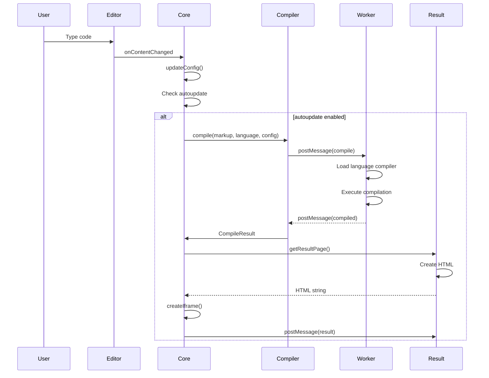

### Result Page Generation

The result page is generated by combining compiled code from all editors:

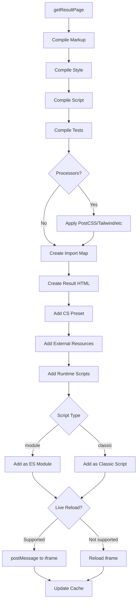

---

## Key Workflows

### App Initialization

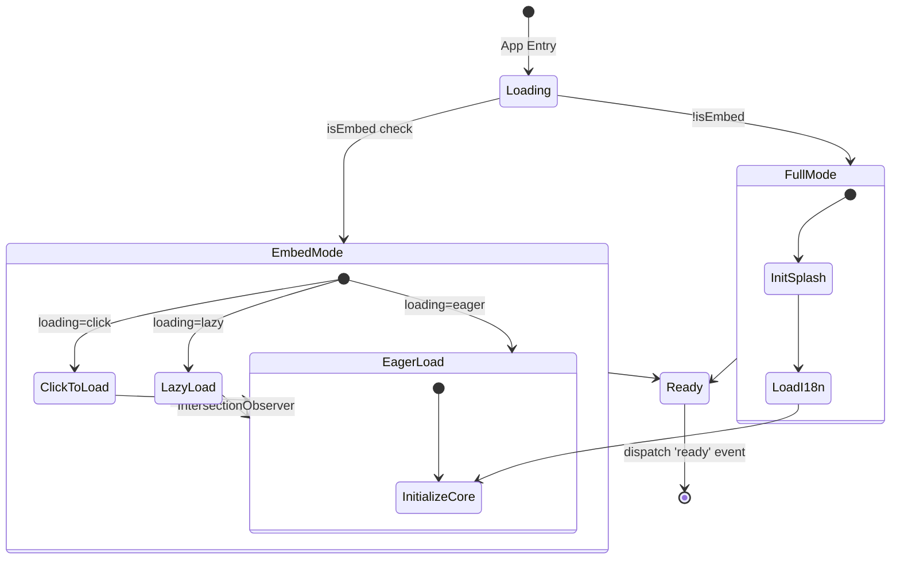

### Run Code Workflow

When the user triggers code execution (Run button or auto-update):

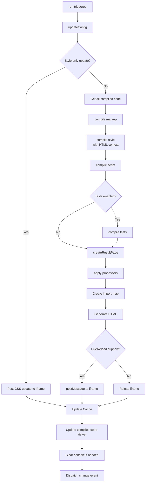

### Editor Language Change

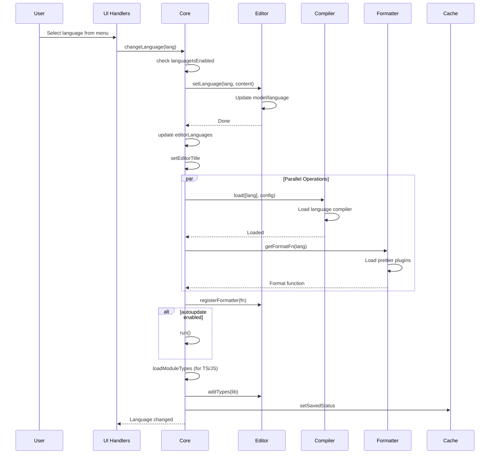

---

## System Interactions

### Event System

LiveCodes uses a publish/subscribe pattern for cross-component communication:

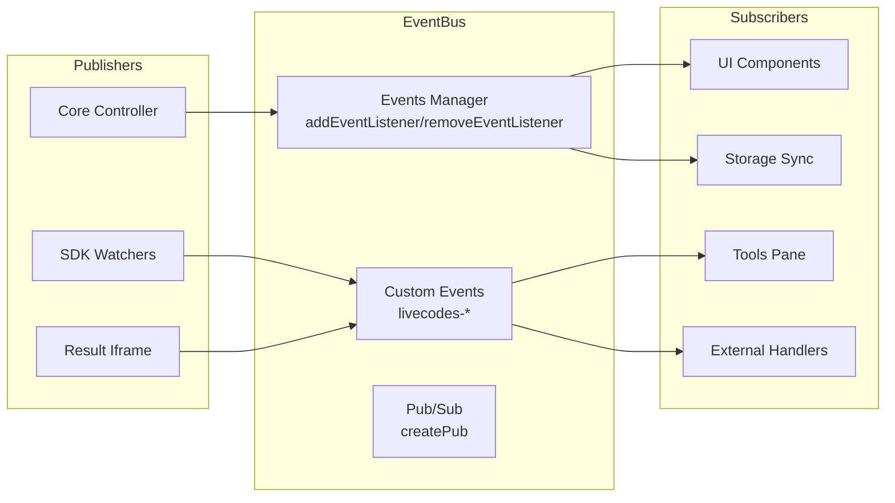

**Custom Events**:

| Event                     | When Fired           | Payload              |
| ------------------------- | -------------------- | -------------------- |
| `livecodes-init`          | App starts loading   | `{ appVersion }`     |
| `livecodes-ready`         | Project loaded       | -                    |
| `livecodes-load`          | Load triggered (SDK) | -                    |
| `livecodes-change`        | Code changed         | `{ code, config }`   |
| `livecodes-test-results`  | Tests completed      | `{ results, error }` |
| `livecodes-console`       | Console output       | `{ method, args }`   |
| `livecodes-destroy`       | App destroyed        | -                    |
| `livecodes-resize-editor` | Editor resize        | -                    |

**Pub/Sub for SDK**:

```typescript
const sdkWatchers = {
  load: createPub<void>(),
  ready: createPub<void>(),
  code: createPub<{ code: Code; config: Config }>(),
  tests: createPub<{ results: TestResult[]; error?: string }>(),
  console: createPub<{ method: string; args: any[] }>(),
  destroy: createPub<void>(),
};
```

### Storage System

The storage system provides persistent storage using IndexedDB (via LocalForage) and localStorage:

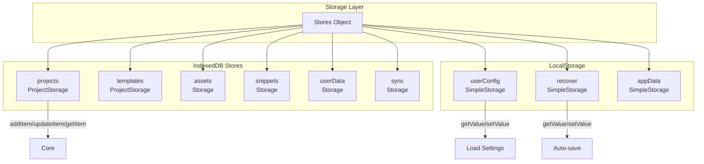

**Storage Operations**:

```typescript
// Save project
projectId = await stores.projects?.addItem(projectConfig);

// Load project
constsavedConfig = await stores.projects?.getItem(projectId);

// User preferences
stores.userConfig?.setValue({ theme: 'dark', autoupdate: true });

// Recovery
stores.recover?.setValue({ config: getContentConfig(getConfig()), lastModified: Date.now() });
```

### Services Layer

External services are abstracted behind interfaces:

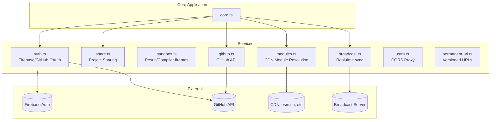

### Compiler System

The compiler system uses Web Workers for performance:

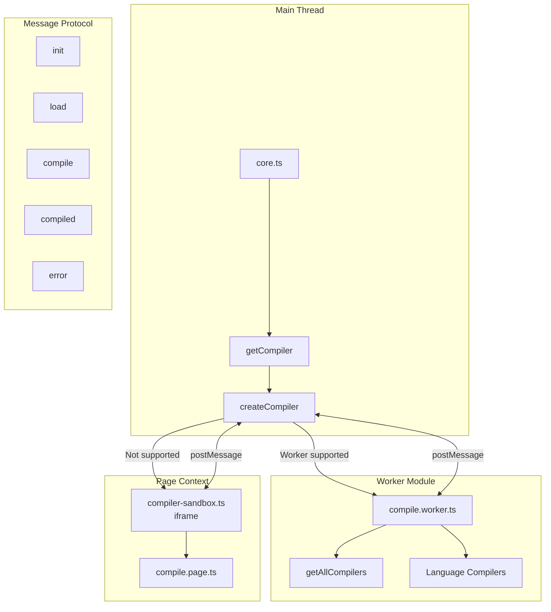

**Worker vs Page Context**:

| Compiler Type           | Environment  | Reason                      |
| ----------------------- | ------------ | --------------------------- |
| Most languages          | Worker       | Performance, no UI blocking |
| ReScript, OCaml, Reason | Page/Sandbox | Needs DOM APIs              |
| MDX, Diagrams           | Page/Sandbox | WebAssembly limitations     |
| PostgreSQL              | Page/Sandbox | Creates nested workers      |

---

## Display Modes

LiveCodes supports multiple display modes for different use cases:

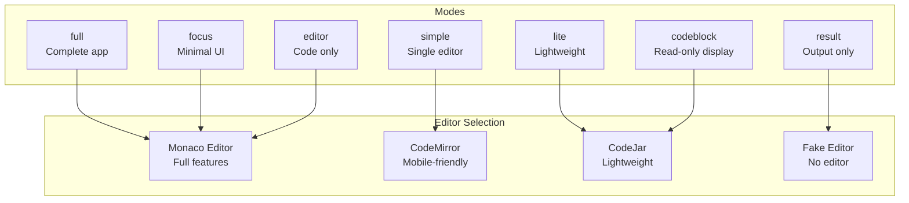

**Mode Features**:

| Mode      | Toolbar | Editors | Result | Tools Pane   |
| --------- | ------- | ------- | ------ | ------------ |
| full      | ✅      | ✅      | ✅     | ✅           |
| focus     | ✅      | ✅      | ✅     | ✅ (console) |
| simple    | ✅      | ✅      | ✅     | ✅           |
| lite      | ❌      | ✅      | ✅     | ❌           |
| editor    | ❌      | ✅      | ❌     | ❌           |
| codeblock | ❌      | ✅      | ❌     | ❌           |
| result    | ❌      | ❌      | ✅     | ✅           |

---

## Import/Export System

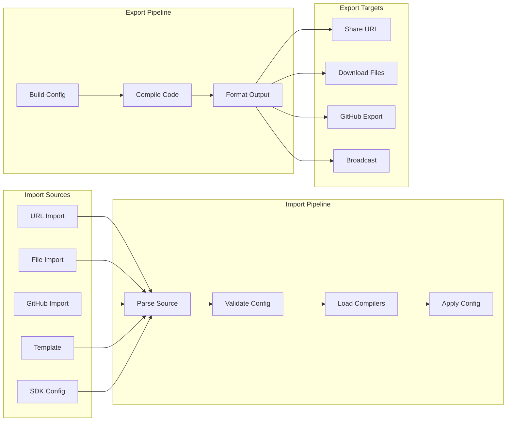

---

## Internationalization (i18n)

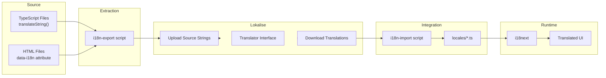

---

## Related Documentation

For detailed information about specific systems, see:

- [Build System](./build-system.mdx) - Build process and outputs
- [Compiler System](./compiler-system.mdx) - Language compilation details
- [Editor System](./editor-system.mdx) - Code editor implementations
- [Configuration System](./config-system.mdx) - Configuration management
- [Storage System](./storage-system.mdx) - Data persistence
- [Services System](./services-system.mdx) - External services
- [UI Design System](./ui-design-system.mdx) - Styles and templates
- [Tools Pane System](./tools-pane-system.mdx) - Console, compiled code, tests
- [Language Support System](./language-support-system.mdx) - Adding languages
- [i18n](./i18n.mdx) - Internationalization
- [Result Page](./result-page.mdx) - Result page generation
