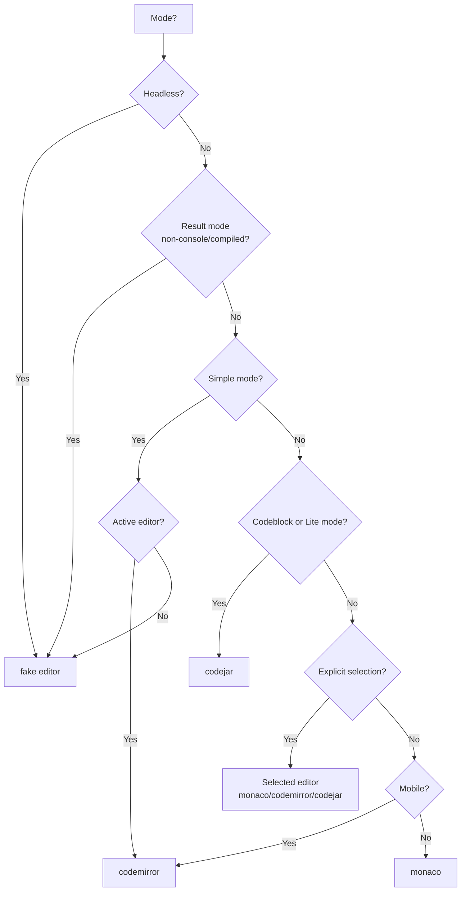

# Editor System

This guide describes the code editor system in LiveCodes, located in `src/livecodes/editor/`.

## Overview

LiveCodes supports multiple code editors with a unified interface, allowing users to choose their preferred editing experience while maintaining consistent functionality across all editors.

## Architecture

### Editor Interface

All editors implement the `CodeEditor` interface defined in `models.ts`.

### Editor Selection



---

## Supported Editors

### 1. Monaco Editor (`editor/monaco/`)

Feature-rich editor based on VS Code's editor.

**Features:**

- IntelliSense with autocomplete
- TypeScript/JavaScript type checking
- Go to definition
- Emmet support (HTML, CSS, JSX)
- Vim and Emacs keybindings
- Minimap
- Code folding
- Package info hover
- TailwindCSS IntelliSense

**File:** `monaco.ts`

**Key Methods:**

- `addTypes()` - Adds TypeScript type definitions for IntelliSense
- `configureEmmet()` - Enables/disables Emmet
- `configureEditorMode()` - Sets Vim/Emacs mode
- `configureTailwindcss()` - TailwindCSS class completion
- `addCloseTag()` - Auto-close HTML tags

**Custom Build:**

A [custom build](https://github.com/live-codes/monaco-editor) is used for Monaco editor, which allows:

- Loading ESM build from CDN (without using the Monaco loader)
- Selecting a specific TypeScript version for the editor.

**Custom Language Support:**

A set of Monaco custom languages is maintained in a separate repo: [live-codes/monaco-languages](https://github.com/live-codes/monaco-languages). They provide syntax highlighting for languages that are not supported out of the box. In addition extra features like autocompletion, go to definition, etc are provided for these languages.

---

### 2. CodeMirror Editor (`editor/codemirror/`)

Mobile-friendly, extensible editor.

**Features:**

- Autocompletion via TypeScript worker
- Vim and Emacs keybindings
- Minimap support
- Emmet support
- Relative line numbers
- Indentation markers
- CSS color picker

**File:** `codemirror.ts`

**Key Methods:**

- `loadTS()` - Loads TypeScript language support via WebWorker
- `addTypes()` - Adds TypeScript definitions via compiler

**TypeScript Integration:**
Uses a WebWorker loaded from the compiler iframe for TypeScript features:

**Custom Build:**

A [custom build](https://github.com/live-codes/codemirror) is used for CodeMirror editor, which allows:

- Bundling and minification of the core modules (e.g. `state`, `view`, etc) and language support for common languages (`html`, `css`, `js`, `json`) to avoid unnecessary network requests and larger module size. Extensions in this bundle are marked as external during build of other modules. This allows all of them to point to the same URL using importmaps (see [app.html](https://github.com/live-codes/livecodes/blob/develop/src/livecodes/html/app.html)).
- Other extensions are lazy-loaded on-demand.

---

### 3. CodeJar Editor (`editor/codejar/`)

Lightweight editor using PrismJS for syntax highlighting.

**Features:**

- Minimal bundle size
- PrismJS syntax highlighting
- Line numbers support
- Basic editing features

**File:** `codejar.ts`

**Best suited for:**

- Codeblock display mode
- Lite mode playgrounds
- Read-only playgrounds
- Performance-critical scenarios

---

### 4. Fake Editor (`editor/fake-editor.ts`)

Placeholder editor for non-interactive contexts.

**Used when:**

- Headless mode
- Result mode (hidden editors)
- Simple mode (inactive editors)

---

## Custom Editors

### Blockly Editor (`editor/blockly/`)

Visual block-based editor for the Blockly language.

### Quill Editor (`editor/quill/`)

Rich text editor for the Richtext language.

**Factory Function:**

```typescript
export const createCustomEditors = (options): CustomEditors => ({
  blockly: createBlocklyEditor(options),
  richtext: createQuillEditor(options),
});
```

---

## Themes System

### Theme Resolution (`editor/themes.ts`)

Supports per-editor, per-dark/light-mode themes:

```typescript
// Theme format: "editor:themeName@light|dark"
// Examples:
// "monaco:vs-dark"
// "codemirror:one-dark@dark"
// "codejar:vsc-dark-plus"
```

**Theme Priority:**

1. Matched by editor + app theme
2. Matched by editor only
3. Default for app theme

### Editor-Specific Themes

| Editor     | Theme Files                       |
| ---------- | --------------------------------- |
| Monaco     | `monaco/monaco-themes.ts`         |
| CodeMirror | `codemirror/codemirror-themes.ts` |
| CodeJar    | `codejar/prism-themes.ts`         |

---

## Fonts System (`editor/fonts.ts`)

Provides 30+ programming fonts loaded on-demand:

```typescript
export interface Font {
  id: string;
  name: string;
  label?: string;
  url: string;
}

export const fonts: Font[] = [
  { id: 'fira-code', name: 'Fira Code', url: fontFiraCodeUrl },
  { id: 'jetbrains-mono', name: 'JetBrains Mono', url: fontJetbrainsMonoUrl },
  // ... 30+ fonts
];
```

---

## TypeScript Configuration (`editor/ts-compiler-options.ts`)

Shared TypeScript compiler options for Monaco and CodeMirror.

---

## Editor Options

Options are transformed based on editor context, e.g., `editorId`, `mode`, `readonly`, etc.
