# Export System

This guide describes the export system in LiveCodes, located in `src/livecodes/export/`.

## Overview

The export system allows exporting projects to various formats including JSON, ZIP (source), HTML (result), GitHub Gist, CodePen, and JSFiddle.

## Architecture

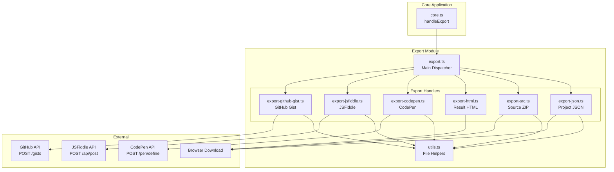

## Export Types

| Type | Handler | Output | Description |
|------|---------|--------|-------------|
| `json` | `exportJSON` | `.json` file | Project configuration |
| `src` | `exportSrc` | `.zip` file | Source files + result + config |
| `html` | `exportHTML` | `.html` file | Standalone result page |
| `codepen` | `exportCodepen` | CodePen URL | Prefilled CodePen pen |
| `jsfiddle` | `exportJsfiddle` | JSFiddle URL | Prefilled JSFiddle |
| `githubGist` | `exportGithubGist` | Gist URL | Public GitHub gist |

## Core Dispatcher (export.ts)

The main dispatcher routes to appropriate handlers:

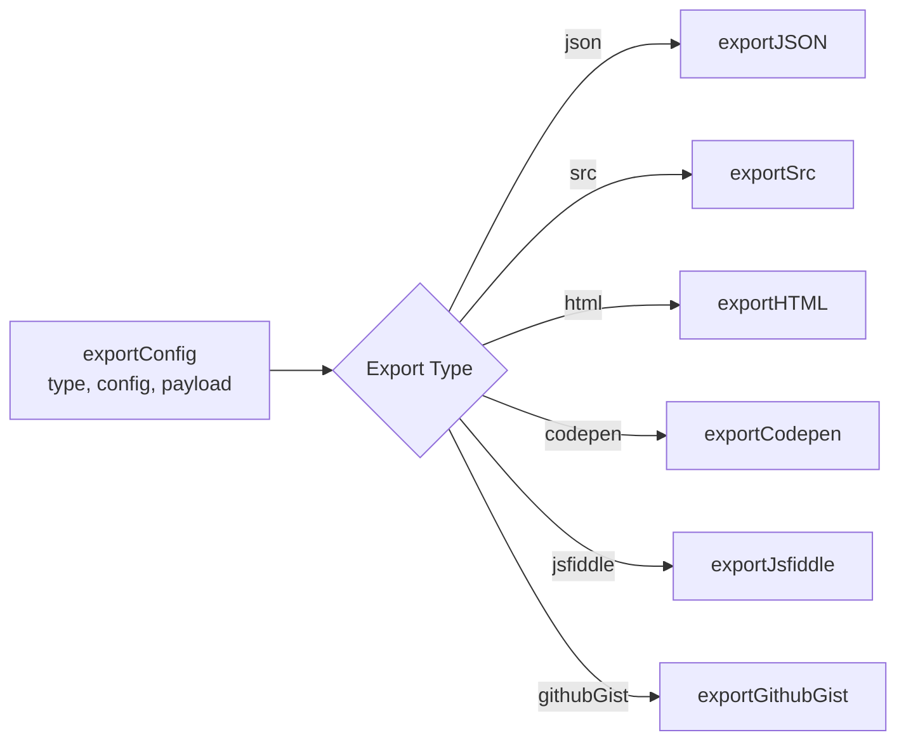

## Utility Functions (utils.ts)

### getFilesFromConfig

Extracts file structure from configuration:

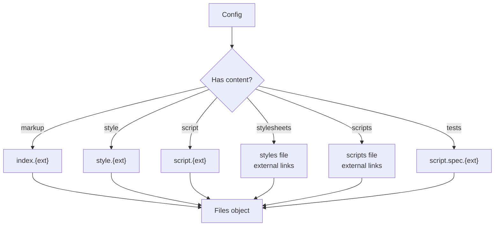

### getContent

Handles language support for export targets:

Supported languages vary by platform:
- **CodePen**: markdown, haml, less, scss, sass, stylus, babel, typescript, coffeescript, livescript
- **JSFiddle**: haml, scss, sass, babel, typescript, coffeescript

For unsupported languages, compiled code is used.

### getCompilerScripts

External compiler scripts needed for non-JS languages:

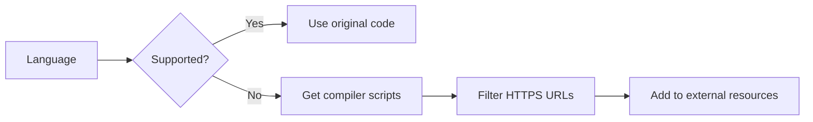

## Export Handlers

### JSON Export (export-json.ts)

Exports project configuration:

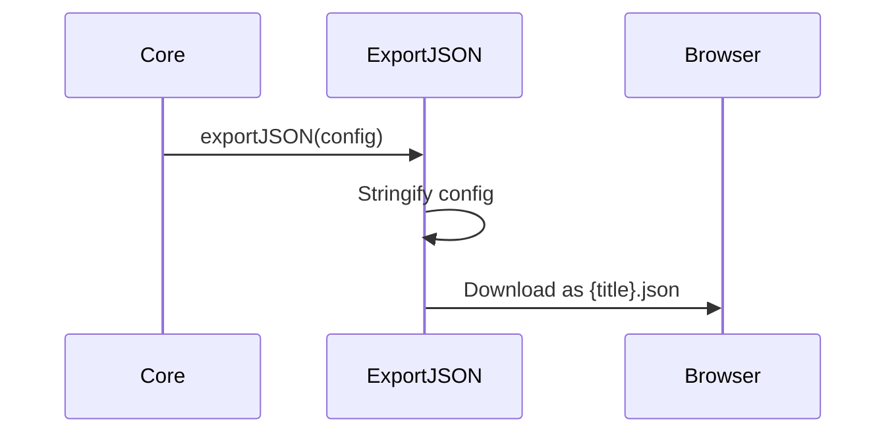

### Source Export (export-src.ts)

Creates ZIP with all project files:

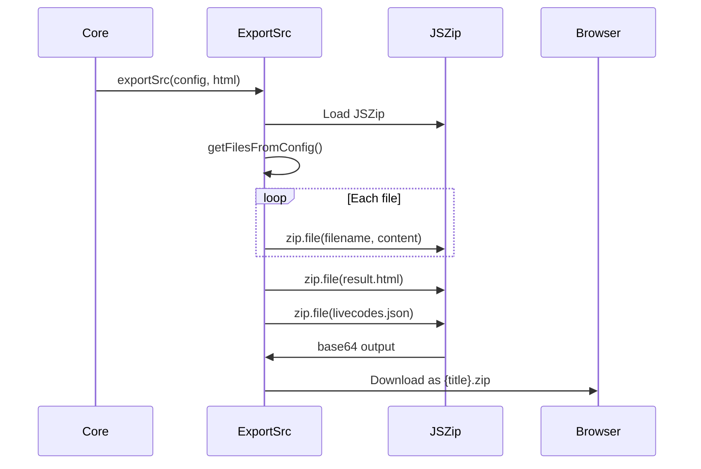

### HTML Export (export-html.ts)

Exports standalone result page:

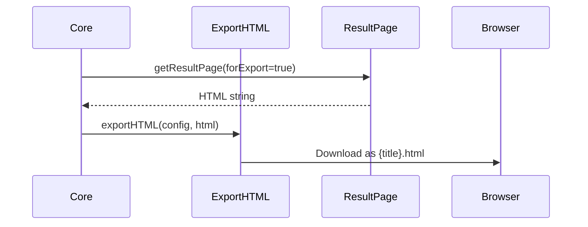

### CodePen Export (export-codepen.ts)

Creates prefilled CodePen:

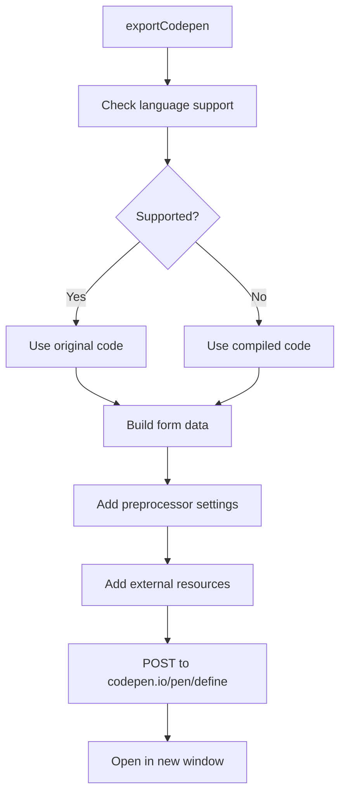

### JSFiddle Export (export-jsfiddle.ts)

Creates prefilled JSFiddle:

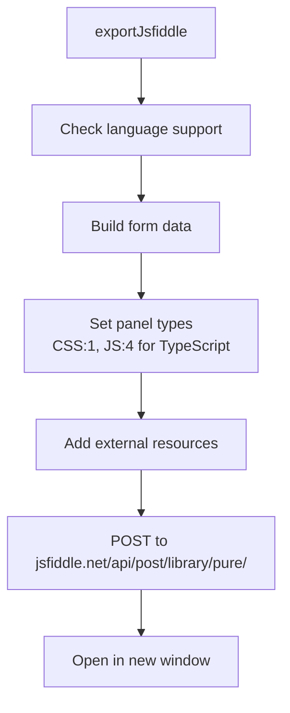

### GitHub Gist Export (export-github-gist.ts)

Creates public GitHub gist:

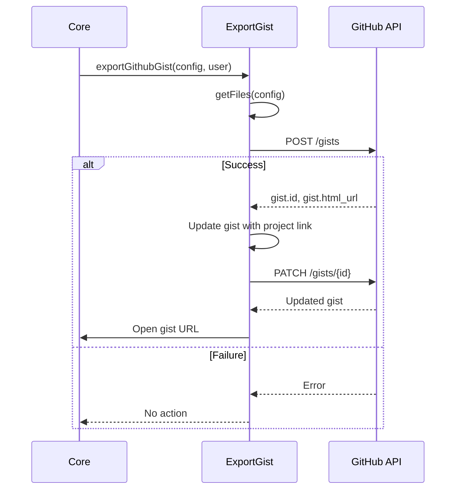

## Usage in core.ts

### handleExport Function

Main entry point for export functionality:

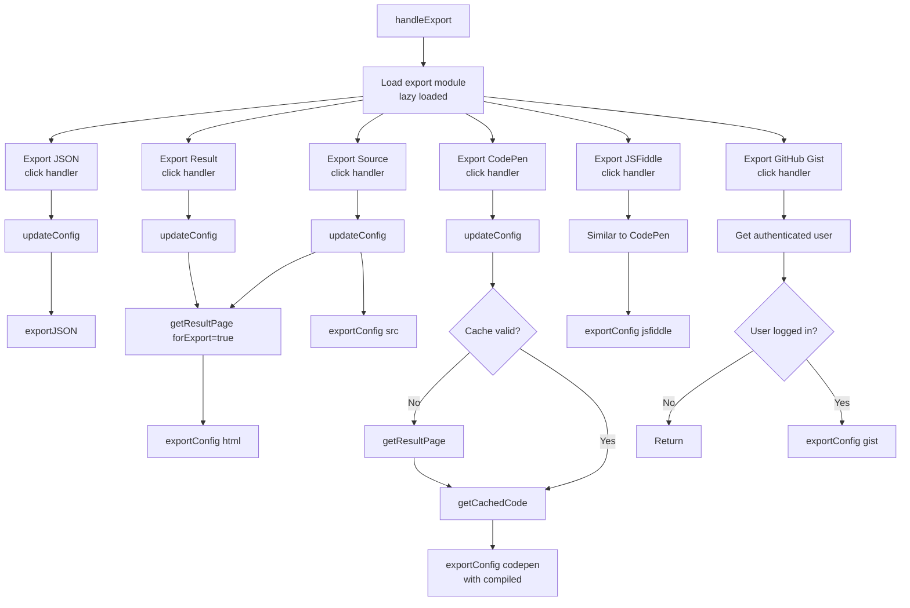

### Lazy Loading

Export handlers are lazy-loaded to reduce initial bundle size:

```typescript
let exportModule: typeof import('./export/export');
const loadModule = async () => {
  exportModule = exportModule || (await import(baseUrl + '{{hash:export.js}}'));
};
```

## Bulk Export

Multiple projects can be exported via the Saved Projects screen:

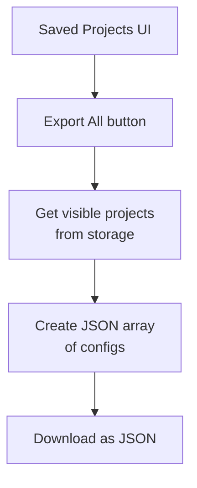

## File Structure

```
src/livecodes/export/
├── index.ts              # Public exports
├── export.ts              # Main dispatcher
├── export-json.ts         # JSON export
├── export-src.ts          # Source ZIP export
├── export-html.ts         # Result HTML export
├── export-codepen.ts      # CodePen export
├── export-jsfiddle.ts     # JSFiddle export
├── export-github-gist.ts  # GitHub Gist export
└── utils.ts               # Shared utilities
```

## Related Documentation

- [Import System](./import-system.mdx) - Importing projects
- [Configuration System](./config-system.mdx) - Configuration object
- [Storage System](./storage-system.mdx) - Project storage
- [Result Page](./result-page.md) - Result generation
- [User Docs: Export](https://livecodes.io/docs/features/export) - User-facing documentation
