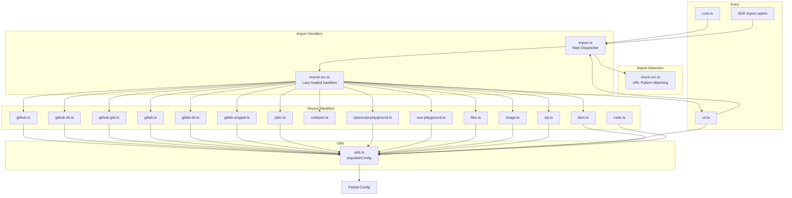
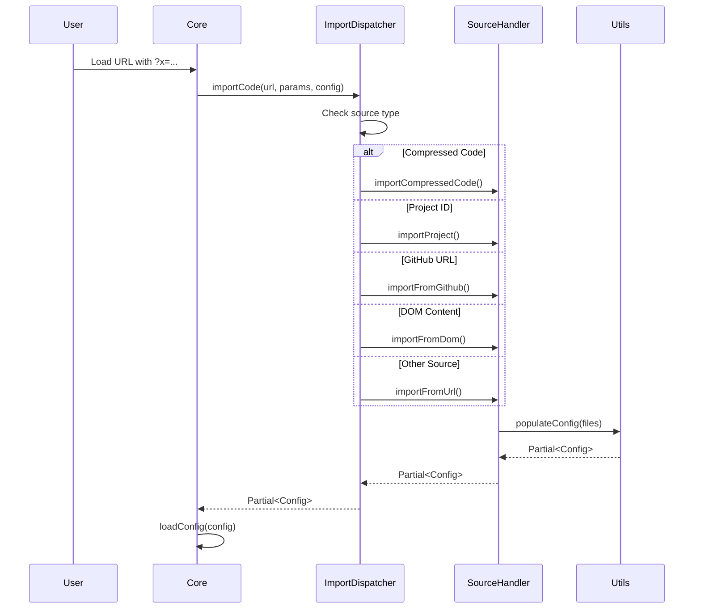
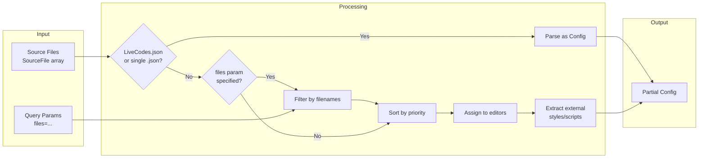
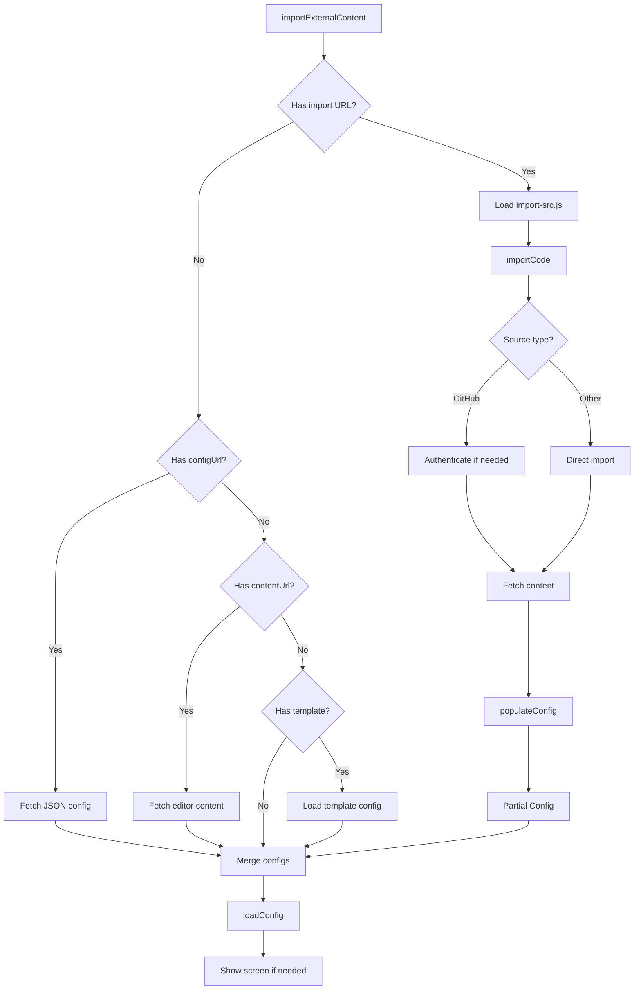

# Import System

This guide describes the import system in LiveCodes, located in `src/livecodes/import/`.

## Overview

The import system allows loading projects from various external sources including GitHub, GitLab, JS Bin, compressed code, local files, images (OCR), and more. It provides a unified interface for detecting import sources and populating the editor configuration.

## Architecture



## Import Sources

### Detection (check-src.ts)

URL patterns determine the import source:

| Source | Pattern | Function |
|--------|---------|----------|
| Compressed Code | `code/...` | `isCompressedCode()` |
| Shared Project | `id/...` | `isProjectId()` |
| DOM Content | `dom/...` | `isDom()` |
| GitHub File | `github.com/.../blob/...` | `isGithubUrl()` |
| GitHub Directory | `github.com/.../tree/...` | `isGithubDir()` |
| GitHub Gist | `gist.github.com/...` | `isGithubGist()` |
| GitLab File | `gitlab.com/.../blob/...` | `isGitlabUrl()` |
| GitLab Directory | `gitlab.com/.../tree/...` | `isGitlabDir()` |
| GitLab Snippet | `gitlab.com/.../snippets/...` | `isGitlabSnippet()` |
| CodePen | `codepen.io/...` | `isCodepen()` |
| JS Bin | `jsbin.com/...` | `isJsbin()` |
| TypeScript Playground | `typescriptlang.org/play` | `isTypescriptPlayground()` |
| Vue Playground | `play.vuejs.org` | `isVuePlayground()` |

### Import Flow



## Core Components

### import.ts - Main Dispatcher

Routes import requests to appropriate handlers:

```typescript
export const importCode = async (
  url: string,
  params: { [key: string]: any },
  config: Config,
  user: User | null | void,
  baseUrl: string,
): Promise<Partial<Config>> => {
  // Fast path: compressed code
  if (isCompressedCode(url)) return importCompressedCode(url);
  
  // Fast path: shared project ID
  if (isProjectId(url)) return importProject(url);
  
  // Lazy-load full import module
  const importSrc = await import(baseUrl + '{{hash:import-src.js}}');
  
  // Route based on URL detection
  if (isDom(url)) return importFromDom(url, params, config);
  if (isGithubGist(url)) return importFromGithubGist(url, params);
  if (isGithubDir(url)) return importFromGithubDir(url, params, user);
  if (isGithubUrl(url)) return importFromGithub(url, user);
  // ... other sources
  
  return importFromUrl(url, params, config);
};
```

### utils.ts - Config Population

Converts source files into configuration:



**File Priority Rules:**

1. `LiveCodes.json` or single `.json` file → parsed as complete config
2. Files matching `files` query param
3. Priority filenames:
   - Markup: `index.*`, `default.*`
   - Style: `style.*`, `styles.*`
   - Script: `script.*`, `app.*`, `main.*`, `index.*`
4. Lower priority: `README`, `.md` files, extensionless files

## Import in core.ts

### importExternalContent()

Main entry point for importing external content:



### Usage Patterns

**URL Import:**
```typescript
// From query param
const importUrl = params.x || parent.location.hash.substring(1);

// Via importExternalContent
await importExternalContent({ config, importUrl });
```

**SDK Import:**
```typescript
// From SDK config
const sdkConfig = importCompressedCode(params.config ?? '');
await importExternalContent({ config, sdkConfig });
```

**Template Import:**
```typescript
await importExternalContent({ config, template: 'template-id' });
```

## Supported Import Sources

| Source | Handler | Features |
|--------|---------|----------|
| GitHub File | `github.ts` | Single file import |
| GitHub Directory | `github-dir.ts` | Multiple files, file selection |
| GitHub Gist | `github-gist.ts` | Multi-file gists |
| GitLab File | `gitlab.ts` | Single file import |
| GitLab Directory | `gitlab-dir.ts` | Multiple files |
| GitLab Snippet | `gitlab-snippet.ts` | Snippet import |
| JS Bin | `jsbin.ts` | Bin import |
| CodePen | `codepen.ts` | Pen structure parsing |
| TypeScript Playground | `typescript-playground.ts` | Decompress playground URL |
| Vue Playground | `vue-playground.ts` | Decompress playground URL |
| Local Files | `files.ts` | Drag & drop, file picker |
| Image (OCR) | `image.ts` | Tesseract.js OCR |
| ZIP File | `zip.ts` | Extract and import |
| DOM Content | `dom.ts` | CSS selector extraction |
| Raw URL | `url.ts` | Fetch and language detection |
| Project JSON | `project-id.ts` | Shared project ID |
| Compressed Code | `code.ts` | Base64 + LZ-string |

## File Structure

```
src/livecodes/import/
├── index.ts              # Public exports
├── import.ts             # Main dispatcher
├── import-src.ts         # Lazy-loaded source handlers
├── check-src.ts          # URL pattern detection
├── code.ts               # Compressed code import
├── project-id.ts         # Shared project import
├── utils.ts              # Config population
├── github.ts             # GitHub file import
├── github-dir.ts         # GitHub directory import
├── github-gist.ts        # GitHub gist import
├── gitlab.ts             # GitLab file import
├── gitlab-dir.ts         # GitLab directory import
├── gitlab-snippet.ts     # GitLab snippet import
├── jsbin.ts              # JS Bin import
├── codepen.ts            # CodePen import
├── typescript-playground.ts  # TypeScript playground
├── vue-playground.ts     # Vue playground
├── files.ts              # Local files import
├── image.ts               # Image OCR import
├── zip.ts                 # ZIP file import
├── url.ts                 # Raw URL import
└── dom.ts                 # DOM content import
```

## Related Documentation

- [Configuration System](./config-system.mdx) - How imported config is merged
- [Architecture Overview](./architecture.mdx) - System interactions
- [User Docs: Import](https://livecodes.io/docs/features/import) - User-facing documentation