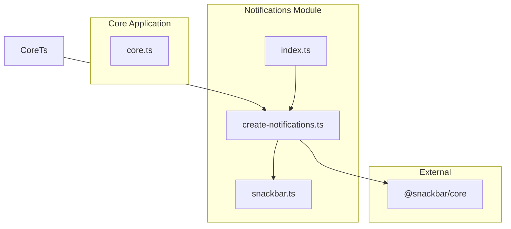
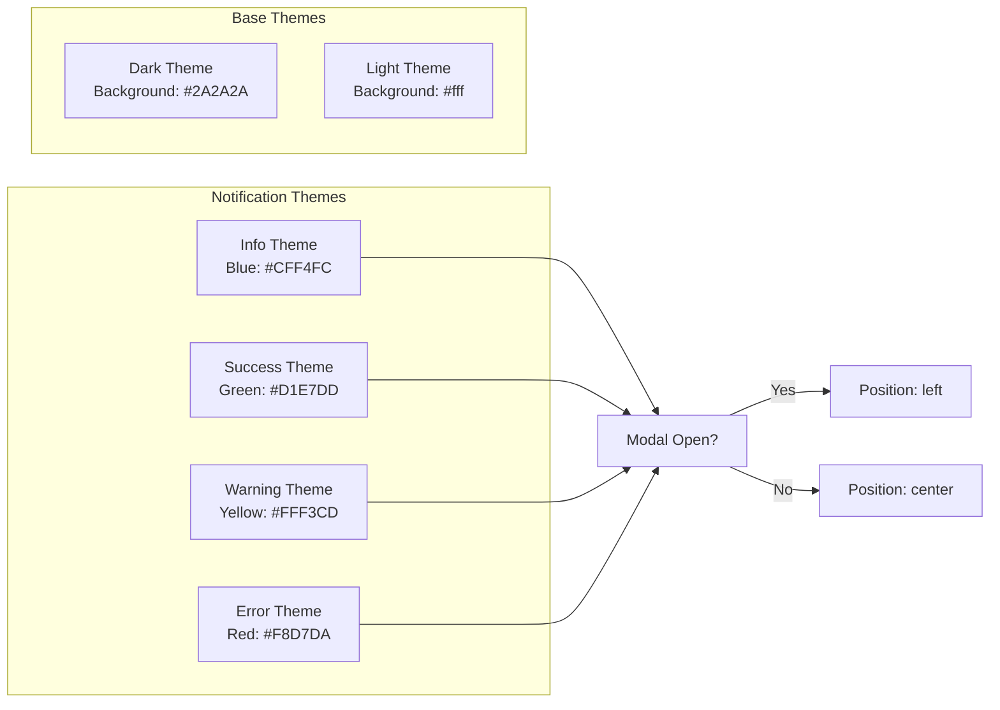

# Notifications System

This guide describes the notifications system in LiveCodes, located in `src/livecodes/notifications/`.

## Overview

The notifications system provides user feedback through non-intrusive snackbars (toast messages). It wraps the `@snackbar/core` library with themed notifications for different message types.

## Architecture



## Interface

```typescript
interface Notifications {
  info: (message: string, dismissable?: boolean) => void;
  success: (message: string, dismissable?: boolean) => void;
  warning: (message: string, dismissable?: boolean) => void;
  error: (message: string, dismissable?: boolean) => void;
  confirm: (message: string, confirmCallback: () => void, cancelCallback?: () => void) => void;
}
```

## Notification Types

| Method      | Purpose                | Theme             | Prefix |
| ----------- | ---------------------- | ----------------- | ------ |
| `info()`    | Informational messages | Blue background   | None   |
| `success()` | Success feedback       | Green background  | `✓ `   |
| `warning()` | Warning messages       | Yellow background | None   |
| `error()`   | Error feedback         | Red background    | `✖ `  |
| `confirm()` | Confirmation dialogs   | Theme-aware       | None   |

## Themes



## Usage in Core

The notifications system is created during app initialization:

```typescript
let notifications: Notifications;

// In app initialization
notifications = createNotifications();
```

### Common Patterns

**Informational Message:**

```typescript
notifications.info(
  window.deps.translateString(
    'core.changeLanguage.message',
    'Loading {{lang}}. This may take a while!',
    { lang: getLanguageTitle(language) },
  ),
);
```

**Success Feedback:**

```typescript
notifications.success(
  window.deps.translateString('core.save.success', 'Project locally saved to device!'),
);
```

**Error Feedback:**

```typescript
notifications.error(window.deps.translateString('core.error.login', 'Login error!'));
```

**Confirmation Dialog:**

```typescript
notifications.confirm(
  window.deps.translateString('core.template.delete', 'Delete template "{{item}}"?', {
    item: item.title,
  }),
  async () => {
    // Confirm callback
    await stores.templates.deleteItem(item.id);
  },
  () => {
    // Cancel callback (optional)
    modal.close();
  },
);
```

## Position Logic

Notifications position themselves based on modal state:

```typescript
const getPosition = () =>
  document.querySelector<HTMLDialogElement>('dialog#modal')?.open ? 'left' : 'center';
```

- **Modal open**: Notifications appear on the left
- **Modal closed**: Notifications appear in the center

## Auto-Dismiss

All notifications auto-dismiss after 2 seconds (`timeout: 2000`), unless `dismissable` is set to `false`:

```typescript
// Auto-dismisses after 2 seconds
notifications.success('Saved!');

// Remains visible until manually dismissed
notifications.info('Loading...', false);
```

## Keyboard Handling

Pressing `Escape` dismisses all open notifications:

```typescript
addEventListener('keydown', (event) => {
  if (event.key === 'Escape' && hasOpenNotifications()) {
    event.preventDefault();
    destroyAllSnackbars();
  }
});
```

## Dependencies

- **@snackbar/core**: External library for snackbar UI

## File Structure

```
src/livecodes/notifications/
├── index.ts              # Public exports
├── create-notifications.ts  # Factory function
└── snackbar.ts           # Themes and actions
```

## Integration with i18n

Messages support internationalization via `window.deps.translateString()`:

```typescript
notifications.success(
  window.deps.translateString(
    'core.fork.success', // i18n key
    'Forked as a new project', // fallback value
  ),
);
```

## Related Documentation

- [UI Design System](./ui-design-system.mdx) - Styles and templates
- [Events System](./architecture.mdx#event-system) - Cross-component communication
