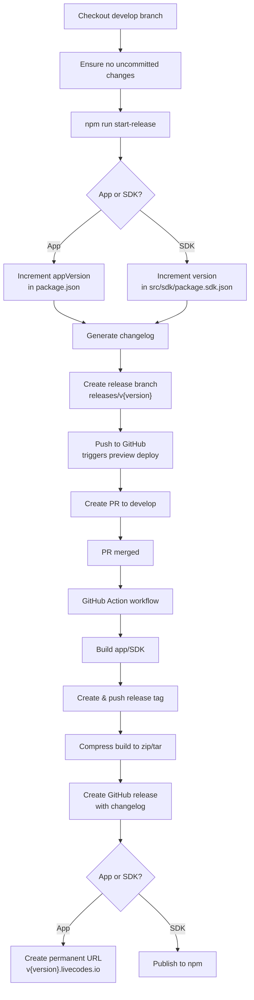

# Release

To start a new release:

- Checkout the branch `develop`.
- Make sure there are no uncommitted changes.
- Run `npm run start-release` and answer the prompts. This will:
  - Increment the version number:  
    App -> "./package.json" (`appVersion`)  
    SDK -> "./src/sdk/package.sdk.json" (`version`)
  - Generate changelog.
  - Create a release branch (`releases/v{version}` | `releases/sdk-v{version}`) and commit changes.
  - Push the branch to GitHub (which triggers a preview deploy).
  - Create a pull request to `develop`.
- Once the pull request is merged a GitHub action workflow runs, which will:
  - Build the app.
  - Create and push a release tag:  
    App -> v\{version\}  
    SDK -> sdk-v\{version\}
  - Compress the build directory to zip and tar files.
  - Create a release:
    - Use changelog as release notes.
    - Upload compressed files as release artifacts.
  - Create a pull request to `main`.
  - If App release -> create a permanent URL (v\{version\}.livecodes.io) which is a proxy to preview deploy.
  - If SDK release -> publish to npm.

## Note

App versions are numeric e.g. `v20`  
SDK versions are semver e.g. `v1.2.3`
