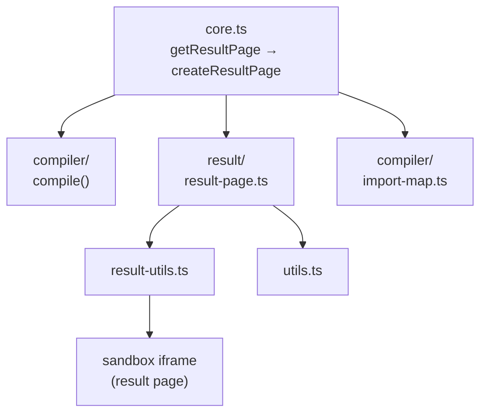

# Result Page

This guide describes how LiveCodes generates the result page, located in `src/livecodes/result/`.

## Overview

The result page is a single HTML document loaded in a [sandboxed iframe](https://www.html5rocks.com/en/tutorials/security/sandboxed-iframes/). It contains compiled code from all editors (markup, style, script), external resources, and runtime dependencies.

## Architecture



---

## Result Page Structure

Generated HTML structure:

```html
<!doctype html>
<html {htmlAttrs}>
  <head>
    <title>{title}</title>
    <meta name="description" content="{description}" />
    {custom head content} {CSS preset} {external stylesheets} {editor styles} {language runtime CSS}
    {language runtime JS}
    <script type="importmap">
      {...}
    </script>
    {external scripts}
  </head>
  <body>
    {compiled markup} {compiled script} {spacing script (optional)} {test scripts (optional)}
  </body>
</html>
```

---

## Core Functions

### createResultPage()

Main function that generates the complete HTML:

```typescript
export const createResultPage = async ({
  code,           // Compiled code from all editors
  config,         // User configuration
  forExport,      // Export mode flag
  template,       // HTML template
  baseUrl,        // App base URL
  singleFile,     // Single file vs multi-file mode
  runTests,       // Run tests flag
  compileInfo,    // Compilation metadata
}): Promise<string>
```

**Key Steps:**

1. Parse template HTML with DOMParser
2. Add development utilities (unless exporting)
3. Apply configuration (title, description, HTML attrs)
4. Add CSS preset and external stylesheets
5. Insert compiled markup
6. Process import maps
7. Add compiled styles
8. Add language runtime dependencies
9. Add compiled script (with proper type)
10. Add test runner (if enabled)

---

### getResultPage() in core.ts

Coordinates compilation and result generation:

```typescript
const getResultPage = async ({ sourceEditor, forExport, template, singleFile, runTests }) => {
  // 1. Compile all editors
  const markupCompileResult = await compiler.compile(markupContent, markupLanguage, config);
  const scriptCompileResult = await compiler.compile(scriptContent, scriptLanguage, config);
  const styleCompileResult = await compiler.compile(styleContent, styleLanguage, config);

  // 2. Handle SFC/processor dependencies
  // CSS processors need HTML context

  // 3. Create result page
  const result = await createResultPage({
    code: compiledCode,
    config,
    forExport,
    template,
    baseUrl,
    singleFile,
    runTests,
    compileInfo,
  });

  // 4. Cache and broadcast
  setCache({ ...compiledCode, result: cleanResultFromDev(result) });
  return result;
};
```

---

## Iframe Creation

### createIframe()

Creates and manages the result iframe:

```typescript
const createIframe = (container, result, service) =>
  new Promise((resolve) => {
    const iframe = document.createElement('iframe');
    iframe.setAttribute(
      'sandbox',
      'allow-same-origin allow-downloads allow-forms allow-modals ' +
        'allow-orientation-lock allow-pointer-lock allow-popups ' +
        'allow-presentation allow-scripts',
    );

    // Optimization: style-only updates
    if (styleOnlyUpdate) {
      iframe.contentWindow.postMessage({ styles }, service.getOrigin());
      return;
    }

    // Optimization: live reload for supported languages
    if (liveReload) {
      iframe.contentWindow.postMessage({ result }, service.getOrigin());
      return;
    }

    // Full page load
    iframe.src = service.getResultUrl() + query;
    container.appendChild(iframe);
    iframe.addEventListener('load', () => {
      iframe.contentWindow.postMessage({ result }, service.getOrigin());
    });
  });
```

**Update Modes:**

| Mode            | Condition                      | Behavior                           |
| --------------- | ------------------------------ | ---------------------------------- |
| **Style-only**  | Only style editor changed      | Send CSS updates via postMessage   |
| **Live reload** | `liveReload: true` in compiler | Send compiled code via postMessage |
| **Full reload** | Default                        | Reload iframe with new result      |

---

## Import Map Generation

### import-map.ts

Handles ES module resolution:

```typescript
// Pattern matching for imports
export const importsPattern =
  /import\s+?(?:(?:(?:[\w*\s{},\$]*)\s+from\s+?)|))((?:".*?")|(?:'.*?'))/g;
export const dynamicImportsPattern = /import\s*?\(\s*?((?:".*?")|(?:'.*?'))\s*?\))/g;
```

**Key Functions:**

```typescript
// Extract imported modules from code
getImports(code) => string[]

// Create import map for module resolution
createImportMap(code, config) => Record<string, string>

// Replace bare import specifiers with URLs
replaceImports(code, config, { importMap }) => string

// Convert CommonJS to ESM
cjs2esm(code) => string

// Create CSS modules import map
createCSSModulesImportMap(compiledScript, compiledStyle, cssTokens)
```

---

## Result Utils

### result-utils.ts

Script injected into result page for development:

```typescript
// Console proxy - forwards logs to parent
proxyConsole();

// Handle eval requests from console
handleEval();

// Report resize to parent
handleResize();

// Maintain scroll position
handleScrollPosition();

// Message handling
window.addEventListener('message', (event) => {
  if (event.data.styles != null) {
    // Style-only update
    document.querySelector('#__livecodes_styles__').innerHTML = event.data.styles;
  }
  if (event.data.flush) {
    // Clear result
    document.body.innerHTML = '';
    document.head.innerHTML = '';
  }
});
```

### utils.ts

Utility functions for result page:

```typescript
// Type detection for console output
typeOf(obj) => string

// Format console arguments for parent frame
consoleArgs(args) => Array<{ type, content }>

// Proxy console to parent frame
proxyConsole()

// Listen for console eval requests
handleEval()

// Report window resize
handleResize()

// Restore scroll position
handleScrollPosition()
```

---

## Import Resolution Flow

```
┌─────────────────────────────────────────────────────────────────┐
│                     import-map.ts                               │
│                                                                 │
│  1. getImports(code) → ['react', 'vue', './component.vue']      │
│  2. createImportMap(code, config)                               │
│     - Check config.imports                                      │
│     - Check config.customSettings.imports                       │
│     - Use modulesService.getModuleUrl() for CDN resolution      │
│  3. Handle special cases:                                       │
│     - Stylesheet imports (.css) → <link> tag                    │
│     - SFC imports (.vue, .svelte) → compile & data URL          │
│     - CSS modules → export class mappings                       │
└─────────────────────────────────────────────────────────────────┘
                              │
                              ▼
┌─────────────────────────────────────────────────────────────────┐
│                    Result Page                                  │
│                                                                 │
│  <script type="importmap">                                      │
│    {                                                            │
│      "imports": {                                               │
│        "react": "https://esm.sh/react@18",                      │
│        "./script": "data:text/javascript;base64,...",           │
│        "./style.module.css": "data:text/javascript;base64,..."  │
│      }                                                          │
│    }                                                            │
│  </script>                                                      │
└─────────────────────────────────────────────────────────────────┘
```

---

## Language Runtime Dependencies

Compilers can define runtime CSS and JS dependencies:

```typescript
const compiler = {
  // CSS loaded in <head>
  styles: ['style1.css', 'style2.css'],
  // or
  styles: ({ compiled, baseUrl, config }) => [...],

  // Scripts loaded in <head>
  scripts: ['lib1.js', 'lib2.js'],
  // or
  scripts: ({ compiled, baseUrl, config }) => [...],

  // Inline script in <head>
  inlineScript: 'console.log("inline");',
  // or
  inlineScript: async ({ baseUrl }) => '...',

  // Scripts that should be loaded as ES modules
  inlineModule: 'export default {};',

  // Imports to add to import map
  imports: {
    'react': 'https://esm.sh/react@19',
    'react/': 'https://esm.sh/react@19/',
  },
};
```

---

## Special Cases

### JSX Runtime Injection

For React/Solid JSX, runtime is injected when:

```typescript
const shouldInsertJsxRuntime =
  Object.keys(jsxRuntimes).includes(code.script.language) &&
  !config.customSettings[code.script.language]?.disableAutoRender &&
  hasDefaultExport(code.script.compiled) &&
  !hasCustomJsxRuntime(code.script.content) &&
  !importFromScript;
```

### CSS Modules

CSS class names are tokenized:

```typescript
createCSSModulesImportMap(
  compiledScript, // Script with imports
  compiledStyle, // CSS with hashed classes
  cssTokens, // { 'original-class': 'hashed_x123' }
  styleExtension, // 'css', 'scss', etc.
);
```

### Script Type Determination

```typescript
const scriptType =
  compiler.scriptType || // Language default
  config.customSettings.scriptType || // User setting
  (isModuleScript(script) ? 'module' : undefined); // Auto-detect ESM
```

---

## Export vs Development

| Feature                  | Development     | Export             |
| ------------------------ | --------------- | ------------------ |
| Dev utils script         | ✅ Included     | ❌ Removed         |
| Spacing.js               | ✅ If enabled   | ❌ Excluded        |
| Test runner              | ✅ If enabled   | ❌ Excluded        |
| Data URLs                | Inline          | Inline or external |
| `data-env="development"` | Attr on scripts | Removed            |

---

## Result Template

Located in `html/sandbox/v9/index.html`:

```html
<!doctype html>
<html>
  <head>
    <script id="message-script" data-env="development">
      window.addEventListener('message', function (event) {
        var html = event.data.result || event.data.html;
        if (html) {
          document.open();
          document.write(html);
          document.close();
        }
      });
    </script>
  </head>
  <body></body>
</html>
```

---

## Console Messaging

The result iframe communicates with parent via postMessage:

| Message Type                        | Direction       | Purpose           |
| ----------------------------------- | --------------- | ----------------- |
| `{ result }`                        | Parent → Iframe | Compiled result   |
| `{ styles }`                        | Parent → Iframe | Style-only update |
| `{ flush }`                         | Parent → Iframe | Clear result      |
| `{ type: 'console', method, args }` | Iframe → Parent | Console output    |
| `{ type: 'resize', sizes }`         | Iframe → Parent | Window resize     |
| `{ type: 'scroll', position }`      | Iframe → Parent | Scroll position   |
| `{ type: 'testResults', results }`  | Iframe → Parent | Test results      |
| `{ type: 'loading', payload }`      | Iframe → Parent | Loading state     |
| `{ type: 'clicked' }`               | Iframe → Parent | User clicked      |
