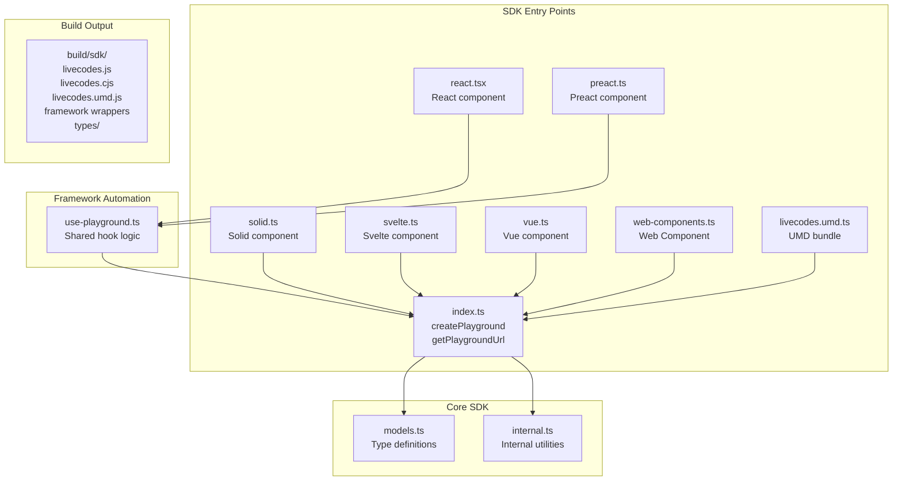
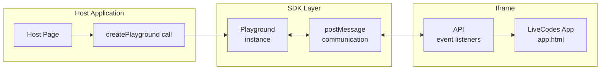
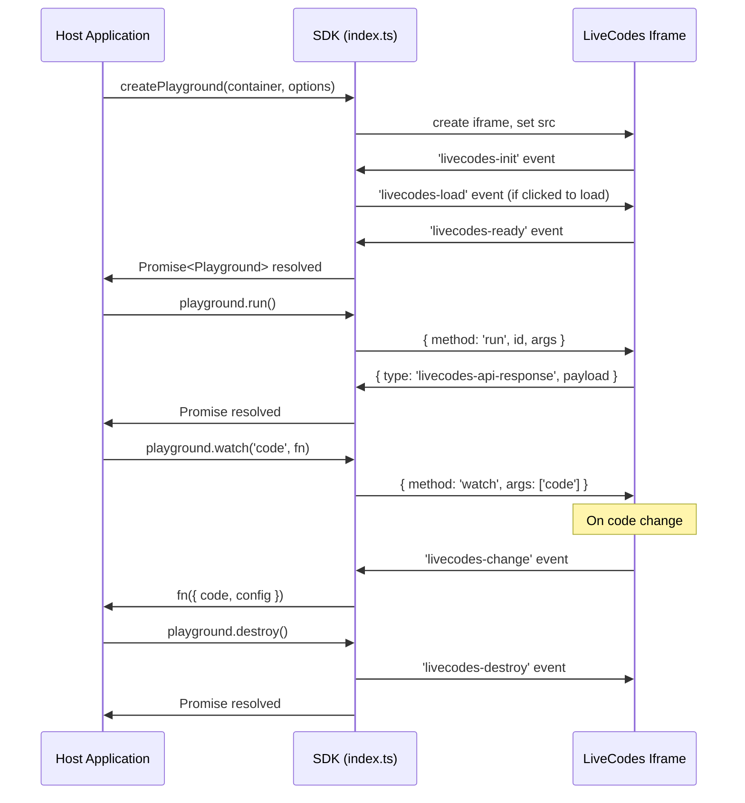

# SDK System

This document describes the LiveCodes Software Development Kit (SDK) architecture, located in `src/sdk/`. The SDK allows embedding LiveCodes playgrounds in any web application with a programmatic API.

## Overview

The SDK provides:

- **ESM module** (`livecodes.js`) for modern JavaScript/TypeScript
- **CommonJS module** (`livecodes.cjs`) for Node.js environments
- **UMD bundle** (`livecodes.umd.js`) for script tag inclusion
- **Framework wrappers** for React, Vue, Svelte, Solid, Preact, and Web Components

## Architecture



## Core Concepts

### Iframe-Based Architecture

The SDK embeds LiveCodes in a sandboxed iframe:



**Why iframe?**

- Security sandbox isolation
- Independent execution context
- Style/script isolation
- Cross-origin capabilities

### Communication Protocol

The SDK communicates with the playground via `postMessage`:



### Event Types

Defined in `src/sdk/internal.ts`:

| Event                    | Direction    | Purpose                           |
| ------------------------ | ------------ | --------------------------------- |
| `livecodes-init`         | Iframe → SDK | App initialized with version info |
| `livecodes-load`         | SDK → Iframe | Trigger load (for click-to-load)  |
| `livecodes-ready`        | Iframe → SDK | Playground ready for API calls    |
| `livecodes-change`       | Iframe → SDK | Code or config changed            |
| `livecodes-console`      | Iframe → SDK | Console output from result        |
| `livecodes-test-results` | Iframe → SDK | Test run complete                 |
| `livecodes-api-response` | Iframe → SDK | API method response               |
| `livecodes-destroy`      | Iframe → SDK | Playground destroyed              |

## Entry Points

### `index.ts` - JavaScript/TypeScript SDK

The main entry point exports `createPlayground` and `getPlaygroundUrl`:

```typescript
// Main function - creates embedded playground
export async function createPlayground(
  container: string | HTMLElement,
  options?: EmbedOptions,
): Promise<Playground>;

// URL generator - creates playground URL without embedding
export function getPlaygroundUrl(options?: EmbedOptions): string;

// Type exports
export type { Code, Config, EmbedOptions, Language, Playground };
```

**Key responsibilities:**

1. Create and manage iframe element
2. Set up postMessage communication
3. Queue and resolve API calls
4. Handle lazy loading (IntersectionObserver)
5. Manage event watchers
6. Provide cleanup via `destroy()`

### `getPlaygroundUrl`

Generates a URL that can be shared or opened directly:

```typescript
const url = getPlaygroundUrl({
  config: {
    markup: { language: 'html', content: '<h1>Hello</h1>' },
  },
  // Large config goes to URL hash (compressed)
  // Small params go to search params
});
// Returns: https://livecodes.io/?x=#config/...
```

## Playground API

The `Playground` interface (from `src/sdk/models.ts`) exposes:

```typescript
interface Playground extends API {
  // Lifecycle
  load: () => Promise<void>; // Load if click-to-load
  destroy: () => Promise<void>; // Clean up iframe and listeners

  // Execution
  run: () => Promise<void>; // Run the code
  runTests: () => Promise<{ results: TestResult[] }>;

  // Configuration
  getConfig: (contentOnly?: boolean) => Promise<Config>;
  setConfig: (config: Partial<Config>) => Promise<void>;

  // Code access
  getCode: () => Promise<Code>;

  // Sharing
  getShareUrl: (shortUrl?: boolean) => Promise<string>;

  // UI
  show: (panel, options?) => Promise<void>;
  format: (allEditors?: boolean) => Promise<void>;

  // Events
  watch: (event: SDKEvent, fn: SDKEventHandler) => { remove: () => void };
  onChange: (fn) => { remove: () => void }; // deprecated
  exec: (command, ...args) => Promise<any>;
}
```

## Framework Wrappers

### Pattern

All framework wrappers share a common pattern - they wrap `createPlayground` and provide:

1. A component that accepts `EmbedOptions` as props
2. A `sdkReady` callback prop for accessing the SDK instance
3. Container element management (ref/style)

### React (`react.tsx`)

```tsx
import LiveCodes from 'livecodes/react';

// Props extend EmbedOptions
<LiveCodes
  config={{ markup: { language: 'html', content: '<h1>Hi</h1>' } }}
  height="400px"
  sdkReady={(playground) => {
    // SDK instance available
    playground.run();
  }}
/>;
```

Implementation uses a shared `use-playground.ts` hook (shares logic with Preact):

```tsx
const usePlayground = createUsePlayground({ useEffect, useRef });
```

### Vue (`vue.ts`)

```vue
<LiveCodes
  :config="{ markup: { language: 'html', content: '<h1>Hi</h1>' } }"
  @sdk-ready="onSdkReady"
/>
```

### Svelte (`svelte.ts`)

```svelte
<LiveCodes
  config={{ markup: { language: 'html', content: '<h1>Hi</h1>' } }}
  on:sdkReady={onSdkReady}
/>
```

### Solid (`solid.ts`)

```tsx
<LiveCodes
  config={{ markup: { language: 'html', content: '<h1>Hi</h1>' } }}
  sdkReady={onSdkReady}
/>
```

### Web Components (`web-components.ts`)

```html
<live-codes template="react"></live-codes>

<script type="module">
  import 'livecodes/web-components';

  const el = document.querySelector('live-codes');
  el.config = { markup: { language: 'html', content: '<h1>Hi</h1>' } };
  el.addEventListener('sdkready', (e) => {
    const sdk = e.detail.sdk;
  });
</script>
```

## Type Definitions (`models.ts`)

The SDK types are carefully designed to be tree-shakeable and avoid internal dependencies:

```typescript
// Core types - exported from SDK
export type {
  Code, // Editor code content
  Config, // Full configuration object
  EmbedOptions, // SDK embedding options
  Language, // Language identifier union type
  Playground, // SDK instance interface
  API, // SDK methods interface
  // ... many more
};
```

**Important:** Types should not import from internal modules (`src/livecodes/*`). The other way round is allowed (app types can import from SDK types).

## Build Process

### SDK Build (`scripts/build.js`)

```javascript
// ESM build - modern browsers
esbuild.build({
  entryPoints: {
    livecodes: 'src/sdk/index.ts',
    preact: 'src/sdk/preact.ts',
    react: 'src/sdk/react.tsx',
    solid: 'src/sdk/solid.ts',
    svelte: 'src/sdk/svelte.ts',
    vue: 'src/sdk/vue.ts',
  },
  external: ['preact', 'react', 'solid-js', 'svelte', 'vue'],
});

// CommonJS build - Node.js
esbuild.build({
  entryPoints: ['src/sdk/index.ts'],
  format: 'cjs',
  outfile: 'build/sdk/livecodes.cjs',
});

// UMD build - script tag
esbuild.build({
  entryPoints: {
    'livecodes.umd': 'src/sdk/livecodes.umd.ts',
    'web-components': 'src/sdk/web-components.ts',
  },
  format: 'iife',
});
```

### Type Generation (`scripts/bundle-types.js`, `scripts/clean-types.js`)

```bash
# Generate TypeScript declarations
npx tsc -p tsconfig.sdk.json

# Clean internal types, keep only public API
node scripts/clean-types.js

# Optionally bundle types into single file
node scripts/bundle-types.js
```

### Output Structure

```
build/sdk/
├── livecodes.js        # ESM module
├── livecodes.cjs       # CommonJS module (Node.js)
├── livecodes.umd.js    # UMD bundle (script tag)
├── preact.js           # Preact wrapper
├── react.js            # React wrapper
├── solid.js            # Solid wrapper
├── svelte.js           # Svelte wrapper
├── vue.js              # Vue wrapper
├── web-components.js   # Web Components
├── LiveCodes.svelte    # Svelte component source
├── skills/             # AI Intent skills
│   ├── _artifacts/
│   └── livecodes/
├── types/              # TypeScript declarations
│   ├── index.d.ts
│   ├── models.d.ts
│   └── ...
├── package.json
├── LICENSE
└── README.md
dist/jsr/               # JSR package
└── ...
```

## Adding a New Framework Wrapper

1. Create `src/sdk/<framework>.ts` (or `.tsx` for JSX frameworks)

2. Import and use `createPlayground`:

```typescript
import { createPlayground } from './index';
import type { EmbedOptions, Playground } from './models';

export interface Props extends EmbedOptions {
  height?: string;
  style?: Record<string, string>;
  className?: string;
  sdkReady?: (sdk: Playground) => void;
}

export default function LiveCodes(props: Props) {
  // Framework-specific implementation
  // Use container ref
  // Call createPlayground on mount
  // Handle prop changes
  // Clean up on unmount
}
```

3. Add to `scripts/build.js`:

```javascript
esbuild.build({
  entryPoints: {
    // ...existing
    '<framework>': 'src/sdk/<framework>.ts',
  },
  external: ['<framework-dependency>'],
});
```

4. Create Storybook stories in `storybook/_stories/`

5. Update documentation in `docs/docs/sdk/`

## Lazy Loading

The SDK supports three loading modes:

```typescript
// 'lazy' - Load when scrolling into view
createPlayground('#container', { loading: 'lazy' });

// 'eager' - Load immediately
createPlayground('#container', { loading: 'eager' });

// 'click' - Show "Click to load" screen
createPlayground('#container', { loading: 'click' });
```

Implementation uses `IntersectionObserver` for lazy loading:

```typescript
if (loading === 'lazy' && 'IntersectionObserver' in window) {
  observer = new IntersectionObserver((entries) => {
    if (entries[0].isIntersecting) {
      loadLivecodes();
      observer.unobserve(containerElement);
    }
  });
  observer.observe(containerElement);
}
```

## Common Mistakes

### SDK methods are async

```typescript
// WRONG
const code = playground.getCode();
console.log(code.markup); // undefined - code is a Promise

// CORRECT
const code = await playground.getCode();
console.log(code.markup.content);
```

### Config vs EmbedOptions

```typescript
// WRONG - appUrl is not a config property
createPlayground('#container', {
  config: { appUrl: '...' }  // ERROR
});

// CORRECT - appUrl is an EmbedOption
createPlayground('#container', {
  appUrl: '...',              // EmbedOption
  config: { ... },            // Config
});
```

### Container must exist

```typescript
// WRONG - container may not exist yet
createPlayground('#container', { config });

// CORRECT - check container first
const container = document.querySelector('#container');
if (container) {
  createPlayground('#container', { config });
}

// OR use headless mode if no UI needed
createPlayground({ headless: true, config });
```

## Related Documentation

- [Architecture Overview](./architecture.mdx) - High-level architecture
- [Build System](./build-system.mdx) - How the SDK is built
- [Configuration](https://livecodes.io/docs/configuration/configuration-object) - User-facing config docs
- [SDK Methods](https://livecodes.io/docs/sdk/js-ts) - User-facing SDK docs
- [Storybook](./storybook.mdx) - Testing framework wrappers
