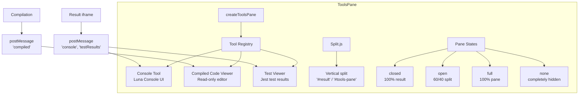

# Tools Pane System

This guide describes the tools pane system in LiveCodes, located in `src/livecodes/toolspane/`.

## Overview

The tools pane is a resizable panel at the bottom of the LiveCodes UI that contains development tools: Console, Compiled Code Viewer, and Test Viewer. It uses Split.js for drag-to-resize functionality and provides a unified interface for all tools.

## Architecture



Each tool is created by a factory function that returns a `Tool` interface:

```typescript
interface Tool {
  name: ToolName;
  title: string;
  load: () => Promise<void>;
  onActivate: () => void;
  onDeactivate: () => void;
  getEditor?: () => CodeEditor | undefined;
}
```

### Tools Pane State

The pane has four states:

```typescript
type ToolsPaneStatus = 'closed' | 'open' | 'full' | 'none' | '';
```

- `closed` - Pane hidden (100% result visible)
- `open` - Pane visible (60/40 split)
- `full` - Pane maximized (100% pane visible)
- `none` - Completely hidden (no gutter visible)

### Layout with Split.js

The pane uses [Split.js](https://split.js.org/) for resizable splits:

```typescript
toolsSplit = Split(['#result', '#tools-pane'], {
  sizes: sizes[status],
  minSize: [0, 0],
  gutterSize,
  direction: 'vertical',
});
```

## Tool Registration

Tools are registered in `createToolsPane`:

```typescript
const fullList: ToolList = [
  { name: 'console', factory: createConsole },
  { name: 'compiled', factory: createCompiledCodeViewer },
  { name: 'tests', factory: createTestViewer },
];
```

Tools can be enabled/disabled via configuration:

```typescript
const isEnabled = (tool: ToolList[number]) =>
  config.tools.enabled === 'all' || config.tools.enabled?.includes(tool.name) === true;
```

## Console Tool

The Console tool (`console.ts`) provides a browser-like console for the result page.

### Implementation

Uses [Luna Console](https://luna.liriliri.io/) for the console UI:

```typescript
consoleEmulator = new LunaConsole(consoleElement, { theme: config.theme });
```

### Message Protocol

Console messages from the result iframe use postMessage:

```typescript
window.addEventListener('message', (event) => {
  if (event.data.type === 'console') {
    consoleEmulator[event.data.method](...convertTypes(event.data.args));
  }
});
```

### Console Input

The console has a code input field with:

- A Monaco/CodeMirror editor for code input
- History navigation (Up/Down arrows)
- Execution on Enter key
- Autocomplete support

### API

```typescript
interface Console extends Tool {
  log: (...args: any[]) => void;
  info: (...args: any[]) => void;
  table: (...args: any[]) => void;
  warn: (...args: any[]) => void;
  error: (...args: any[]) => void;
  clear: (silent?: boolean) => void;
  evaluate: (code: string) => void;
  reloadEditor: (config: Config) => Promise<void>;
  setTheme?: (theme: Theme) => void;
}
```

## Compiled Code Viewer

The Compiled Code Viewer (`compiled-code-viewer.ts`) displays transpiled/compiled code from the active editor.

### Implementation

Creates a read-only editor that updates when compilation completes:

```typescript
const update = (language: Language, content: string, label?: string) => {
  if (editor.getLanguage() !== language) {
    editor.setLanguage(language, content);
  } else {
    editor.setValue(content);
  }
};
```

### TypeScript Fix

Applies a workaround for "cannot-redeclare-block-scoped-variable" error by appending `export {}`:

```typescript
const fixTypes = (language: Language, content: string) => {
  if (language === 'javascript' && editor.monaco) {
    editor.setValue(content + '\nexport {}');
    // Hide the added line
    monacoEditor.setHiddenAreas([new monaco.Range(lineCount + 1, 0, lineCount + 2, 0)]);
  }
};
```

### API

```typescript
interface CompiledCodeViewer extends Tool {
  update: (language: Language, content: string, label?: string) => void;
  reloadEditor: (config: Config) => Promise<void>;
}
```

## Test Viewer

The Test Viewer (`test-viewer.ts`) displays Jest test results from the result page.

### Test Flow

1. Tests run in the result iframe using Jest
2. Results are posted back via `postMessage`
3. The viewer displays passed/failed/skipped tests with errors

### Result Display

```typescript
const showResults = ({ results, error }: { results: TestResult[]; error?: string }) => {
  results.forEach((result) => {
    const item = document.createElement('div');
    item.innerText = result.testPath.join(' › ');
    item.classList.add('test-result', result.status);
    // Append error messages for failures
    result.errors.forEach((err) => {
      const testError = document.createElement('pre');
      testError.classList.add('test-error');
      testError.innerText = err;
      item.appendChild(testError);
    });
    testResultsElement.appendChild(item);
  });
};
```

### Summary

Shows a summary with counts:

```typescript
const passed = results.filter((r) => r.status === 'pass').length;
const failed = results.filter((r) => r.status === 'fail').length;
const skipped = results.filter((r) => r.status === 'skip').length;
```

### API

```typescript
interface TestViewer extends Tool {
  showResults: (data: { results: TestResult[]; error?: string }) => void;
  resetTests: () => void;
  clearTests: () => void;
}
```

## Tools Pane API

```typescript
interface ToolsPane {
  load: () => Promise<void>;
  open: () => void;
  close: () => void;
  maximize: () => void;
  hide: () => void;
  getStatus: () => ToolsPaneStatus;
  getActiveTool: () => ToolName;
  setActiveTool: (name: ToolName) => void;
  disableTool: (name: ToolName) => void;
  enableTool: (name: ToolName) => void;
  console?: Console;
  compiled?: CompiledCodeViewer;
  tests?: TestViewer;
}
```

## Configuration

Configure tools in the config object:

```typescript
config.tools = {
  enabled: 'all' | ['console', 'compiled', 'tests'],
  active: 'console' | 'compiled' | 'tests',
  status: 'closed' | 'open' | 'full' | 'none',
};
```

## Event Flow

1. User clicks a tool title in the tools pane bar
2. `setActiveTool` is called with the tool index
3. The tool's `onActivate` is called (previous tool's `onDeactivate` is called)
4. Tool handles its specific UI updates
5. `updateConfig` persists the state

## Related Files

- `src/livecodes/toolspane/tools.ts` - Main pane factory
- `src/livecodes/toolspane/console.ts` - Console implementation
- `src/livecodes/toolspane/compiled-code-viewer.ts` - Compiled code viewer
- `src/livecodes/toolspane/test-viewer.ts` - Test result viewer
- `src/livecodes/toolspane/test-imports.ts` - Test library imports
- `src/livecodes/result/` - Result page that sends messages to tools
