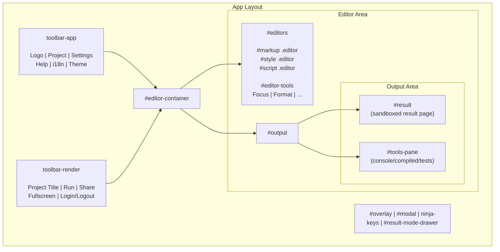

# UI Design System

This guide describes the UI design system in LiveCodes, including styles, HTML templates, and theming.

## Overview

LiveCodes uses a SCSS-based design system with CSS custom properties for dynamic theming. The UI is built from HTML templates that are injected into the DOM and styled via a compiled stylesheet.

The visual identity is anchored around the LiveCodes icon palette: deep navy surfaces, electric cyan (`#00c8ff`) and signal teal (`#00e5c8`) accents, and a live red (`#ff4d4d`) indicator. A fixed `--brand-*` token layer defines this chrome while the existing `--hue/--st/--lt` system continues to allow user `themeColor` customization.

## Style Architecture

### Main Stylesheet (`app.scss`)

The primary stylesheet defines CSS custom properties for:

**Space Units:**

```scss
--unit: 16px;
--s2: 2px;
--s4: 4px;
--s8: 8px;
--s12: 12px;
--s16: 16px;
--s24: 24px;
--s32: 32px;
--s40: 40px;
  --rs: 6px;   // border-radius (buttons, inputs, menus)
  --rs-lg: 12px; // border-radius (cards, modals, drawers)
```

**Color System:**

The color system has two layers:

1. **User-themeable layer** (`--hue`, `--st`, `--lt`) — drives buttons, links, active states, focus rings.
2. **Brand layer** (`--brand-*`) — fixed identity colors for chrome, independent of user `themeColor`.

```scss
// User-themeable
--hue: 214; // Base hue (214 = blue)
--st: 40%;  // Saturation
--lt: 50%;  // Lightness

// Derived colors
--color: hsl(var(--hue), var(--st), var(--lt));
--color10: ... --color95: // Lightness variants
```

**Brand Tokens (dark theme):**

```scss
--brand-bg-deep: #080d16;
--brand-bg-elevated: #0d1825;
--brand-bg-elevated-2: #111b2c;
--brand-border: rgba(255, 255, 255, 0.06);
--brand-border-hi: rgba(0, 200, 255, 0.18);
--brand-cyan: #00c8ff;
--brand-teal: #00e5c8;
--brand-live: #ff4d4d;
--brand-text: #dde6f0;
--brand-muted: #556070;
--brand-dim: #2e3a4a;
--brand-glow-cyan: 0 0 24px rgba(0, 200, 255, 0.18);
--brand-glow-cyan-soft: 0 0 12px rgba(0, 200, 255, 0.1);
```

**Typography:**

```scss
--font-ui:
  'DM Sans', system-ui, -apple-system, BlinkMacSystemFont, 'Segoe UI', Roboto,
  'Helvetica Neue', Arial, sans-serif;
--font-mono:
  'JetBrains Mono', ui-monospace, 'Cascadia Code', 'Source Code Pro', Menlo,
  Consolas, monospace;
```

Both fonts are loaded via `@fontsource` packages (`vendors.ts`) and fetched alongside app styles in `core.ts`. System fallbacks render immediately to avoid FOIT.

**Semantic Colors:**

```scss
--darker-bg-color, --darker-bg-active, --darker-color
--dark-bg-color, --dark-bg-active, --dark-color
--link, --light
--console-bg, --dropdown, --layout, --modal
--btn-bg-color, --btn-bg-active, --btn-color
```

---

### Theme Variants (`inc-light.scss`)

Light theme swaps color values and mirrors the brand token palette for light surfaces:

```scss
:root.light {
  --lt: 100%;
  --color10: hsl(var(--hue), var(--st), calc(var(--lt) * 0.1));
  // ... inverted lightness scale
  --icon-filter: invert(0.3);

  // Light-mode brand overrides
  --brand-bg-deep: #f4f7fb;
  --brand-bg-elevated: #fff;
  --brand-bg-elevated-2: #f0f3f8;
  --brand-border: rgba(13, 24, 37, 0.08);
  --brand-border-hi: rgba(0, 130, 178, 0.28);
  --brand-cyan: #0096cc;
  --brand-teal: #00a896;
  --brand-live: #e63946;
  --brand-text: #1a2332;
  --brand-muted: #5a6b80;
  --brand-dim: #97a4b6;
}
```

### RTL Support (`inc-rtl.scss`)

Right-to-left layout adjustments:

```scss
html[dir='rtl'] {
  #editors,
  #tools-pane,
  .custom-editor {
    direction: ltr; // Editors stay LTR
  }
  .submenu {
    right: 98%;
  }
  #modal .close-button {
    left: 1.5rem;
    right: unset;
  }
  // ... mirror transforms
}
```

---

### Loading Styles (`index.css`)

Initial loading screen uses the branded icon SVG and deep navy background:

```css
body,
#livecodes {
  background-color: #080d16;
  color: #e2e8f0;
}

#loading {
  align-items: center;
  display: flex;
  opacity: 1;
  transition: opacity 0.4s ease-in-out;
}

#livecodes {
  opacity: 0; /* Hidden until loaded */
}

@keyframes liveIndicatorGlow { ... }
@keyframes loadingTextPulse { ... }
```

### Design Motifs

**Dot Pattern:**

A subtle dot texture is used on the toolbar and modal title bars, matching the icon background:

```scss
--brand-dot-pattern:
  radial-gradient(circle at 1px 1px, rgba(255, 255, 255, 0.04) 0.75px, transparent 1px);
--brand-dot-size: 28px 28px;
```

**Cyan Glow:**

Focus states and hover effects use a soft cyan glow to create a modern, electric feel:

```scss
// Focus ring
box-shadow: var(--brand-glow-cyan);        // 0 0 24px rgba(0, 200, 255, 0.18)

// Soft hover glow
box-shadow: var(--brand-glow-cyan-soft);    // 0 0 12px rgba(0, 200, 255, 0.1)
```

Applied to buttons, menu items, inputs, modal close buttons, cards, thumbnails, and tags.

---

## HTML Template System

### Template Files

Located in `src/livecodes/html/`:

| Template            | Purpose                                        |
| ------------------- | ---------------------------------------------- |
| `app.html`          | Main app layout                                |
| `app-menu-*.html`   | Dropdown menus (project, settings, help)       |
| `*-screen.html`     | Modal screens (settings, import, deploy, etc.) |
| `welcome.html`      | Welcome screen                                 |
| `templates.html`    | Starter templates selection                    |
| `result-popup.html` | Result page popup                              |

### Template Loading

Templates are imported as raw strings and preprocessed:

```typescript
// index.ts
import appHTMLRaw from './app.html?raw';
import menuProjectHTMLRaw from './app-menu-project.html?raw';

const replaceValues = (str: string) =>
  Object.entries(predefinedValues).reduce(
    (str, [key, value]) => str.replace(new RegExp(`{{${key}}}`, 'g'), value),
    str,
  );

export const appHTML = replaceValues(appHTMLRaw);
```

### Template Variables

Runtime values replaced via `{{variable}}` placeholders:

- `{{baseUrl}}` - App base URL
- `{{hash:app.css}}` - Hashed asset filenames
- `{{appCDN}}` - CDN URL
- `{{esModuleShimsUrl}}` - ES module shims

---

## Main App Structure



---

## Display Modes

Configured via `config.mode`:

| Mode        | Description                         | Editor Used                            |
| ----------- | ----------------------------------- | -------------------------------------- |
| `full`      | Complete app with all features      | Monaco (desktop) / CodeMirror (mobile) |
| `focus`     | Minimal UI, essential elements only | Monaco / CodeMirror                    |
| `simple`    | Single editor + result              | CodeMirror                             |
| `lite`      | Lightweight, minimal features       | CodeJar                                |
| `editor`    | Code editor only                    | Monaco                                 |
| `codeblock` | Read-only code display              | CodeJar                                |
| `result`    | Result page only                    | Fake                                   |

---

## View Configuration

Controlled via `config.view`:

| View     | Description                              |
| -------- | ---------------------------------------- |
| `split`  | Both editor and result visible (default) |
| `editor` | Editor visible, result collapsed         |
| `result` | Result visible, editor collapsed         |

---

## Theming

### Theme Classes

Applied to `<html>` element:

```typescript
// core.ts
document.documentElement.classList.add(theme); // 'light' or 'dark'
```

### Theme Color

CSS custom properties dynamically updated:

```typescript
// core.ts
const changeThemeColor = () => {
  const { themeColor, theme } = getConfig();
  const { h, s, l } = colorToHsla(themeColor);
  document.documentElement.style.setProperty('--hue', `${h}`);
  document.documentElement.style.setProperty('--st', `${s}%`);
  document.documentElement.style.setProperty('--lt', `${theme === 'light' ? 100 : l}%`);
};
```

### Default Colors

```typescript
// core.ts
const getDefaultColor = () => 'hsl(214, 40%, 50%)'; // Blue
```

---

## Key UI Components

### Toolbar

- **toolbar-app**: Logo, menus (Project, Settings, Help), i18n, theme
- **toolbar-render**: Project title, Run/Share buttons, fullscreen

### Editors Panel

- `#editors`: Container for markup/style/script editors
- `#editor-tools`: Toolbar with Focus, Format, Undo/Redo, Copy, etc.

### Tools Pane

- Console: JavaScript console output
- Compiled Code: View compiled output
- Tests: Run test suites

### Modals

```html
<dialog id="modal">
  <div id="modal-container"></div>
  <div class="snackbars-left"></div>
</dialog>
```

### Command Palette

```html
<ninja-keys placeholder="Type a command or search..."></ninja-keys>
```

---

## Internationalization (i18n)

### HTML Attributes

```html
<span data-i18n="app.run.hint" data-i18n-prop="title">Run</span>
```

- `data-i18n` - Translation key
- `data-i18n-prop` - Target property (title, placeholder, etc.)

### RTL Handling

RTL languages automatically apply `inc-rtl.scss`:

```typescript
// Set document direction
document.documentElement.setAttribute('dir', 'rtl');
```

Key RTL adjustments:

- Menus and submenus flip to left side
- Close buttons move to left
- Editor content stays LTR

---

## Responsive Design

### Layout Classes

```scss
.simple-mode { ... }
.focus-mode { ... }
.lite-mode { ... }
.result { ... }
.no-result { ... }
```

### Editor Status

```html
<span id="editor-status">
  <span id="editor-mode" title="Editor Mode"></span>
  <span data-status="markup"></span>
  <span data-status="style"></span>
  <span data-status="script"></span>
</span>
```

---

## CSS Class Naming Conventions

| Pattern           | Example                          | Purpose                 |
| ----------------- | -------------------------------- | ----------------------- |
| `#id`             | `#toolbar`, `#editors`           | Main structure IDs      |
| `.class`          | `.button`, `.menu`               | Reusable components     |
| `.state-class`    | `.hidden`, `.active`, `.visible` | State modifiers         |
| `mode-class`      | `.simple-mode`, `.focus-mode`    | Mode-specific overrides |
| `element-variant` | `.btn-modal`, `.dropdown-height` | Component variants      |

---

## Icon System

Icons use SVG data URL as mask image:

```html
<i class="icon-run"></i>
```

```css
[class^='icon-'] {
  background-color: currentColor;
  display: inline-block;
  height: 1em;
  mask-image: var(--svg);
  mask-repeat: no-repeat;
  mask-size: 100% 100%;
  vertical-align: -0.175em;
  width: 1em;
}

.icon-run {
  --svg: url('data:image/svg+xml,...');
}
```

Icon filters for light theme:

```scss
:root.light {
  --icon-filter: invert(0.3);
  --icon-filter-active: invert(1);
}
```

---

## Adding New UI Components

1. **Create HTML template** in `src/livecodes/html/your-component.html`
2. **Import in `src/livecodes/html/index.ts`** and export
3. **Add styles** to `app.scss` or a new partial file
4. **Use brand tokens** for surfaces, borders, and accents (`--brand-*`)
5. **Add cyan focus-visible** rings for interactive elements (`border-color: var(--brand-cyan); box-shadow: var(--brand-glow-cyan-soft);`)
6. **Update i18n keys** if needed
7. **Instantiate in TypeScript** in `src/livecodes/UI/your-component.ts` via `innerHTML` or DOM manipulation

---

## Testing Styles

Run Storybook for visual component testing:

```bash
npm run storybook
```

See `docs/docs/contribution/storybook.mdx` for details.
